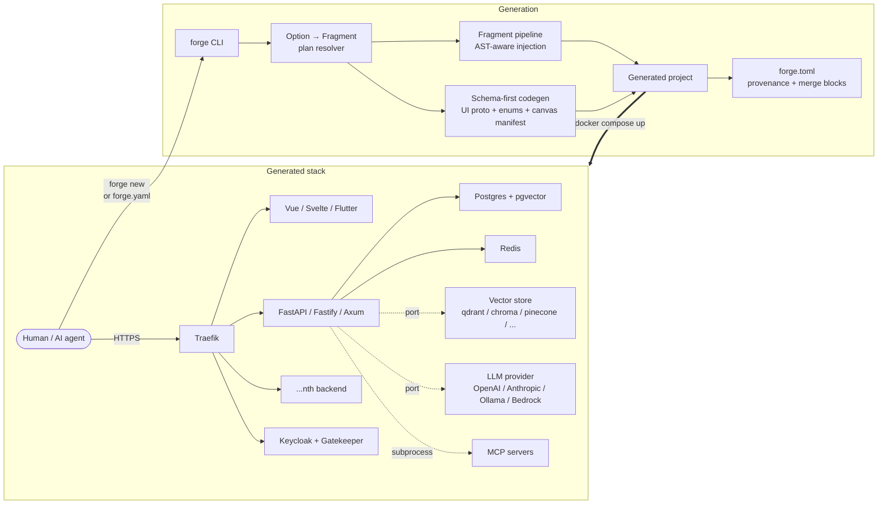

<div align="center">

# forge

*The single-command, polyglot full-stack generator for production services, agent platforms, and RAG apps.*

[](https://github.com/cchifor/forge)
[](https://www.python.org)
[](LICENSE)
[](https://github.com/cchifor/forge)
[](https://github.com/cchifor/forge/actions/workflows/ci.yml)
[](docs/FEATURES.md)
[](docs/FEATURES.md)
[](docs/FEATURES.md)
[](CONTRIBUTING.md)

</div>

> **What's new?**
>
> - **Unreleased (1.2.0 draft) — layered component model (Vue 3)** — a composable three-layer component system layered on top of the option/fragment generator. **Layer-1** basic components (`EntityList` — a data-bound list; `StatCard` — a pure-UI KPI card), **Layer-2** composition, and **Layer-3** app templates (`Console` — left-nav + dashboard; `ChatFirst` — results surface above a docked agent chat). Components reach backend data only through a **data contract** that serves both greenfield (forge emits the backend slice) and brownfield (bind to an existing OpenAPI backend via `frontend.openapi_spec_url` + a non-Turing-complete transform DSL). Components compile to project-scoped, `target_frontends`-gated fragments through the existing appliers — no second generator. New CLI surface: `--component-cmd {list,scaffold}` (with `--component-name` / `--component-layer`) and `--template-cmd list`. Emitted contract types are gated by a real `vue-tsc` zero-error check, and `forge --update` re-runs frontend codegen into `apps/<frontend>/`. See [`ADR-010`](docs/architecture-decisions/ADR-010-layered-component-model.md) (and [`ADR-009`](docs/architecture-decisions/ADR-009-component-layer-vs-parity-tier.md) on why `component_layer` is orthogonal to RFC-006 `parity_tier`).
> - **Unreleased (1.2.0 draft) — bidirectional sync** — `forge --update` (forge → project) is now paired with `forge --harvest` (project → forge), so user edits to fragment-emitted blocks round-trip back as candidate patches against the live forge tree. Closes the FR1 / FR2 / RF1 round-trip invariants with a matrix nightly lane D gate. New CLI surface: `--harvest`, `--verify`, `--accept-harvested`, `--reapply-baseline`, `--emit-pr={github,branch}`, `--resolve` (interactive `.forge-merge` resolver). Tier-1 fragments emit cross-language parity suggestions on harvest; literal-only edits surface an `Option(...)` promotion suggestion via libcst AST analysis. Opt-in telemetry (`--telemetry={local,remote}`) writes JSONL events for verify / harvest / update / resolve. `forge --update` now also re-renders base templates when `_forge_template.toml` version differs (opt out with `--no-template-update`). See [`CHANGELOG.md`](CHANGELOG.md) for the per-verb breakdown.
> - **Unreleased (1.2.0 draft)** — auth-stack rebuild: Gatekeeper as sole token authority (mints ES256 internal JWTs); per-language `platform-auth` SDKs for Python / Node / Rust with cross-SDK parity gate; BFF Redis sessions with two-key TTL atomicity; inactivity-driven session timeout (Vue / Svelte / Flutter composables); RFC 8693 token-exchange for on-behalf-of S2S delegation. See [`docs/auth-architecture.md`](docs/auth-architecture.md) for the model and [`UPGRADING.md`](UPGRADING.md#11--12--auth-stack-rebuild-unreleased) for the migration playbook.
> - **Unreleased (post-1.1.0-alpha.2)** — built-in features colocate under `forge/features/<ns>/`, so authoring a built-in feature uses the same on-disk layout as third-party plugins.
> - **1.1.0-alpha.2** — file-level three-way merge for `forge --update` (default `--mode merge`, `.forge-merge` sidecars on conflict), declarative `compose.yaml` fragment snippets, the plugin-SDK e2e gate, and six new CLI verbs: `--plan-update`, `--remove-fragment`, `--mode={merge,skip,overwrite}`, `--graph`, `--log-json`, `--log-level`.
> - **1.0.x core (intact)** — schema-first UI protocol, provenance manifest, plugin SDK, LibCST / ts-morph AST injection, three-zone merge, published canvas packages.
>
> See [`CHANGELOG.md`](CHANGELOG.md) for the full delta, [`UPGRADING.md`](UPGRADING.md) for migration notes, and the [RFCs](docs/rfcs/) for design context.

`forge` is a CLI that scaffolds production-ready full-stack platforms from a single YAML (or a single interactive run). Where [create-next-app](https://nextjs.org/docs/app/api-reference/cli/create-next-app) and [cookiecutter-fastapi](https://github.com/tiangolo/full-stack-fastapi-template) give you one frontend and one backend, forge combines three backends ([FastAPI](https://fastapi.tiangolo.com/), [Fastify](https://fastify.dev/), [Axum](https://github.com/tokio-rs/axum)), three frontends ([Vue 3](https://vuejs.org/), [Svelte 5](https://svelte.dev/), [Flutter](https://flutter.dev/)), enterprise auth ([Keycloak](https://www.keycloak.org/) + [Gatekeeper](https://gatekeeper.readthedocs.io/) + [Traefik](https://traefik.io/)) and a typed option registry (NixOS / Terraform style — dotted paths, JSON-Schema export) — then wires them behind one reverse proxy with Docker Compose. It's designed to be driven by humans in a terminal **and** by autonomous AI agents through a headless, stdin-pipeable, JSON-first CLI, so CI pipelines, Claude Code, or Copilot workspaces can generate the same project you would.

---

## Architecture



Generate a whole multi-service **system** in one command with the platform presets — `forge --platform {monolithic,microservices,headless-api,multitenant-saas}` assembles several services behind a shared auth/gateway stack (with S2S trust and, for the SaaS preset, per-tenant RLS isolation). See [`docs/platform-generator-guide.md`](docs/platform-generator-guide.md).

See [`docs/architecture.md`](docs/architecture.md) for the internals (registries, injector backends, provenance, codegen). See [`docs/GETTING_STARTED.md`](docs/GETTING_STARTED.md) for the 10-minute tour. Built-in features live under `forge/features/<ns>/` (one directory per namespace, mirroring the third-party plugin layout — see [`docs/plugin-development.md`](docs/plugin-development.md)). The layered component model ([`ADR-010`](docs/architecture-decisions/ADR-010-layered-component-model.md)) resolves selected components into the same fragment plan, so component outputs flow through this exact resolver → injector → codegen path rather than a parallel pipeline.

---

## Layered components (Vue 3)

Beyond the flat option → fragment model, forge composes Vue 3 UIs as a **three-layer component model** ([`ADR-010`](docs/architecture-decisions/ADR-010-layered-component-model.md)). Each layer is a first-class node in a cross-layer dependency graph: it regenerates idempotently through the existing sync stack and reaches backend data only through a **data contract**.

| Layer | What it is | Composes | Seeds shipped |
|---|---|---|---|
| **Layer 1 — basic components** | Self-contained UI units; each consumes at most one data contract (or none — a pure-UI component). | — | `EntityList` (data-bound list, `read` contract), `StatCard` (pure-UI KPI card) |
| **Layer 2 — composed components** | Components built from Layer-1 children, aggregating their contracts. | `children` + `aggregates` | *(graph-supported — compose your own; no standalone seed yet)* |
| **Layer 3 — templates** | Full-app blueprints — pages, routes, nav, and shell — composing Layer-1/2 children. | `children` | `Console` (left-nav + dashboard), `ChatFirst` (docked agent chat) |

**Layering rule:** a component may depend only on the same or a lower layer — upward edges (1→2, 2→3) are rejected; same-layer 2→2 composition is allowed (cycle-checked). The resolver builds a transitive **reverse-dependents** index, so changing one component regenerates exactly its dependents and nothing else.

**Data contract.** A `<Component>.contract.json` declares the component's data dependency as `operations` (`read` / `write` / `subscribe`) whose input/output schemas emit to TypeScript through the existing `ui_protocol` path — so a contract change is caught at build time by `vue-tsc`, never silently at runtime. The same contract serves both modes:

- **Greenfield** — forge emits the backend slice from the contract.
- **Brownfield** — bind to an existing backend's OpenAPI document via `frontend.openapi_spec_url`, mapping each contract operation to an `operationId` with a non-Turing-complete **transform DSL** (field renames via dotted source paths + a closed whitelist of scalar coercions — `int` / `float` / `str` / `bool`).

Components compile to project-scoped, `target_frontends`-gated fragments, so their outputs flow through the **same** resolver → injector → codegen → provenance/merge path as everything else — not a parallel generator. Vue 3 is the first (and currently only) framework target; the seam is framework-agnostic.

Manage them from the CLI — `forge --component-cmd {list,scaffold}` (with `--component-name` / `--component-layer`) and `forge --template-cmd list` — or select them when generating. These UI **component layers** are orthogonal to the generation **[layer discriminators](#layer-discriminators)** (`backend.mode` etc.) and to RFC-006 backend **parity tiers** ([`ADR-009`](docs/architecture-decisions/ADR-009-component-layer-vs-parity-tier.md)).

---

## Frontend layouts

The generated frontend's **app-shell layout** is selectable with `--layout` (or `frontend.layout` in YAML). Each layout is a Layer-3 composition of the reusable Layer-2 regions above, fully responsive across desktop/tablet/mobile, and available for **Vue 3, Svelte 5, and Flutter**:

| Slug | Layout | Best for |
|------|--------|----------|
| `sidebar` *(default)* | left nav + top bar + main | enterprise SaaS / admin |
| `topnav` | top menu + centered content + footer | marketing / content |
| `tabbar` | bottom tab bar → rail → sidebar | touch-first / consumer apps |
| `threepane` | left nav + center + right agent/inspector panel | AI & collaborative tools |
| `bento` | header + asymmetric tile grid | dashboards / SaaS homepages |
| `docs` | doc-tree + content + TOC | developer docs |

```bash
forge --project-name shop --backend-language python --features products --frontend vue --layout topnav --yes
```

Layouts are template variants composed over a shared base via a two-stage render; `sidebar` is the byte-identical baseline. Adding a layout is a drop-in (a `layout.toml` manifest + a thin overlay template) — see [`docs/frontend-layouts.md`](docs/frontend-layouts.md).

---

## Options

Everything configurable is an `Option` with a dotted path, a type (`bool` / `enum` / `int` / `str` / `list`), and a default. Set one at generation time with `--set PATH=VALUE` (repeatable) or in the `options:` block of your YAML config. See [Usage Examples](#usage-examples).

> **📚 Full per-option reference: [`docs/FEATURES.md`](docs/FEATURES.md).**
> That document is the canonical option catalog, **auto-generated from the live `OPTION_REGISTRY`**. It carries every option's path, type, default, summary, full description, allowed values, stability, backends, and the fragments each value enables. **Humans and AI coding agents reading this README should load `docs/FEATURES.md` before generating any forge config** — the README's category-level summary below is just a map.

### Foundation (always included)

| Capability | Backends | What you get |
|---|---|---|
| Polyglot backends | python, node, rust | [FastAPI](https://fastapi.tiangolo.com/) / [Fastify](https://fastify.dev/) / [Axum](https://github.com/tokio-rs/axum) with matching ORM + migrations + lint/test toolchain. |
| Frontends | vue, svelte, flutter | [Vue 3](https://vuejs.org/) + Vite + TanStack Query, [SvelteKit](https://svelte.dev/) + runes, [Flutter](https://flutter.dev/) (web) + Riverpod. All ship an [AG-UI](https://github.com/cchifor/ag-ui) chat panel. |
| Docker-compose + Traefik | all | Generated `docker-compose.yml` with [Traefik](https://traefik.io/) routing `/api/{backend}` per-service. Multi-backend + per-service migrations included. |
| Enterprise auth | all | [Keycloak](https://www.keycloak.org/) realm JSON validated at generate-time, [Gatekeeper](https://gatekeeper.readthedocs.io/) OIDC ForwardAuth, Traefik forward-auth middleware. |
| `forge.toml` stamping | all | Project records forge version + template paths + fully-resolved option map; machine-readable for `forge --update`. |

### Optional features — 31 options across six categories

| Category | Options | Highlights |
|---|---|---|
| **[Observability](docs/FEATURES.md#observability)** | 5 | Distributed tracing ([Logfire](https://logfire.pydantic.dev/) / OTel SDK / OTLP gRPC), OpenTelemetry agent + tool spans, deep `/health`, X-Request-ID correlation, CycloneDX SBOM workflow |
| **[Reliability](docs/FEATURES.md#reliability)** | 6 | Rate limiting (in-memory / [`@fastify/rate-limit`](https://github.com/fastify/fastify-rate-limit) / Axum tower), security headers (CSP / XFO / HSTS), PII log redaction, opt-in response caching, SQLAlchemy connection pool, [purgatory](https://pypi.org/project/purgatory/) circuit breaker |
| **[Async Work](docs/FEATURES.md#async-work)** | 3 | Redis-backed task queue ([Taskiq](https://taskiq-python.github.io/) / [BullMQ](https://docs.bullmq.io/) / [Apalis](https://github.com/geofmureithi/apalis)), off-thread RAG ingest, `QueuePort` (redis / sqs) |
| **[Conversational AI](docs/FEATURES.md#conversational-ai)** | 7 | Chat history persistence, agent WebSocket streaming, tool registry, [pydantic-ai](https://ai.pydantic.dev/) LLM loop, `LlmProviderPort` (OpenAI / Anthropic / Ollama / Bedrock), chat attachments, MCP scaffolds |
| **[Knowledge](docs/FEATURES.md#knowledge)** | 4 | Vector-store backend (`pgvector` / `qdrant` / `chroma` / `milvus` / `weaviate` / `pinecone` / `postgresql`), embeddings provider (OpenAI / Voyage), Cohere reranker + cross-encoder fallback, configurable top-K |
| **[Platform](docs/FEATURES.md#platform)** | 6 | [SQLAdmin](https://aminalaee.dev/sqladmin/) UI, outbound webhook delivery (HMAC-signed), `app info`/`app tools`/`app rag` typer subcommands, AGENTS.md / CLAUDE.md drop, `ObjectStorePort` (s3 / local), strict-CSP nginx config |

Each row links to the corresponding section of [`docs/FEATURES.md`](docs/FEATURES.md), where every option is documented with its full description, default, allowed values, and the fragments it enables.

### Layer discriminators

These options orchestrate generation rather than enabling a fragment bundle. Documented in detail under [Layer discriminators in `docs/FEATURES.md`](docs/FEATURES.md#layer-discriminators--composing-a-project).

| Path | Type | Default | Purpose |
|---|---|---|---|
| `backend.mode` | enum | `generate` | `generate` runs the per-backend Copier pipeline; `none` skips backend generation entirely (frontend-only stacks). |
| `database.mode` / `database.engine` | enum / enum | `generate` / `postgres` | Provisions Postgres + alembic + SQLAlchemy session by default; `none` skips the DB stack for stateless services. |
| `frontend.mode` | enum | `generate` | `generate` / `external` / `none` — orchestrates the per-framework Copier render. |
| `frontend.api_target.type` / `frontend.api_target.url` | enum / str | `local` / `""` | Pair drives whether the Vite proxy hits a Docker-internal backend or an external API base URL. |
| `agent.mode` | enum | `none` | Phase C placeholder for the agentic-stack discriminator; mirrors the other layer modes' shape. |

Introspect the **live** registry anytime with `forge --list` (plugin-aware), `forge --describe <path>`, or `forge --schema` (JSON Schema 2020-12) — these include any third-party plugin options that the bundled `docs/FEATURES.md` doesn't.

---

## Prerequisites

- **[uv](https://docs.astral.sh/uv/)** (latest) — forge ships as a uv tool. The installer bootstraps it if missing.
- **Python ≥ 3.11** — only if you want to regenerate or contribute. End users never need Python directly.
- **[Git](https://git-scm.com/)** — forge initialises a git repo in every generated project.
- **[Docker](https://www.docker.com/) + Compose v2** — required to run the generated stack.
- **Conditional toolchains for the backend / frontend you pick:** [Node.js](https://nodejs.org/) ≥ 22, [Rust](https://rustup.rs/) stable, [Flutter](https://docs.flutter.dev/get-started/install) ≥ 3.19.

forge's unit + integration suite runs on **Ubuntu, macOS, and Windows** against
Python 3.13 in CI. The docker/compose smoke, matrix, and end-to-end generated-project
lanes run on **Ubuntu** (they need Docker + the Node/Rust/Flutter toolchains); Windows
is validated at the unit/integration level via Git Bash.

---

## Quick Start

Three commands. Zero assumptions about prior toolchain install — the installer handles `uv` for you.

1. **Install forge.** The installer detects your OS, installs `uv` if missing, then drops `forge` on your PATH.
   ```bash forge-install
   curl -fsSL https://raw.githubusercontent.com/cchifor/forge/main/install | bash
   ```

2. **Generate a project.** Run `forge` with no arguments for the interactive prompt. (Skip ahead to [Usage Examples](#usage-examples) for the headless YAML and AI-agent pathway.)
   ```bash forge-quick-generate
   forge
   ```

3. **Launch the stack.** `cd` into the output directory and bring everything up.
   ```bash forge-docker-up
   cd my_platform && docker compose up --build
   ```

Your services now answer on `http://app.localhost`, Keycloak on `http://localhost:18080`, and the [Traefik](https://traefik.io/) dashboard on `http://localhost:19090`. Everything is wired.

Stuck on install or generation? See [`docs/troubleshooting.md`](docs/troubleshooting.md) for common gotchas with copy-paste fixes, or run `forge --doctor` to introspect the live environment.

---

## Usage Examples

### Interactive walk-through

```text forge-interactive-transcript
$ forge

  +===================================+
  |             forge                  |
  |      Project Generator             |
  +===================================+

  ? Project name: My Platform
  ? Description: A full-stack application

  -- Backend 1 --
  ? Backend name: api
  ? Backend language: Python (FastAPI)
  ? Backend server port: 5000
  ? Python (FastAPI) version: 3.13
  ? CRUD entities to generate (comma-separated, e.g. items, orders): items
  ? Add another backend? No

  -- Frontend --
  ? Frontend framework: Vue 3
  ? Author name: Ada Lovelace
  ? Package manager: pnpm
  ? Frontend server port: 5173
  ? Enable Keycloak authentication? Yes
  ? Enable AI chat panel? No
  ? Default color scheme: blue

  -- Keycloak --
  ? Keycloak host port: 18080
  ? Keycloak realm: app
  ? Keycloak client ID: my-platform

  -- Summary --
  Project:    My Platform
  Backend:    Python 3.13 on port 5000
  Frontend:   Vue on port 5173
  Features:   items
  Auth:       Keycloak
  Keycloak:   port 18080

  ? Proceed with generation? Yes
  Project generated at: /home/ada/my_platform
```

### Headless generation from a YAML config

Write your stack as a file, then run one command. This is the path most teams will standardise on for CI pipelines.

```yaml forge-project-config
# stack.yaml
project_name: my-shop
description: An e-commerce platform

backend:
  language: python
  server_port: 5000
  features: products, orders, customers
  python_version: "3.13"

frontend:
  framework: vue
  package_manager: pnpm
  include_auth: true

keycloak:
  port: 18080
  realm: my-shop
  client_id: my-shop

options:
  observability.tracing: true
  observability.health: true
  platform.webhooks: true
```

```bash forge-headless-yaml
forge --config stack.yaml --yes --no-docker --json
```

Expected output on stdout (progress goes to stderr):

```json forge-json-success
{
  "project_root": "/home/ada/my-shop",
  "backends": [
    {"name": "backend", "dir": "/home/ada/my-shop/backend", "language": "python", "port": 5000}
  ],
  "backend_dir": "/home/ada/my-shop/backend",
  "frontend_dir": "/home/ada/my-shop/frontend",
  "framework": "vue",
  "features": ["products", "orders", "customers"]
}
```

### AI-agent / stdin pathway

forge's CLI is designed so an autonomous coding agent can generate a project without touching the filesystem first. Pipe a JSON or YAML spec straight in and parse the JSON envelope that comes back.

```bash forge-stdin-pipe-ai-agent
echo '{
  "project_name": "api-gateway",
  "backend": {"language": "rust", "server_port": 5001},
  "frontend": {"framework": "none"},
  "options": {"platform.webhooks": true, "observability.tracing": true}
}' | forge --config - --yes --no-docker --json
```

Exit codes are strict and machine-friendly:

| Code | Meaning |
|---|---|
| `0` | Project generated successfully. stdout contains the success envelope. |
| `1` | User aborted at a prompt (only reachable without `--yes`). |
| `2` | Config, validation, or generation error. stdout is the error envelope; stderr has the human message. |

On failure you'll see:

```json forge-json-error
{"error": "Unknown option 'rag.backendz'. Did you mean: rag.backend?"}
```

### Setting options

Every knob forge exposes is an `Option` with a dotted path — `middleware.rate_limit`, `rag.backend`, `rag.top_k`. Set any of them with `--set PATH=VALUE` (repeatable). Values are coerced to the Option's native type (`true`/`false` → bool, `10` → int, `qdrant` → enum), then validated against the registry.

```bash forge-set-flags
forge --config stack.yaml --yes --no-docker \
  --set rag.backend=qdrant \
  --set rag.embeddings=voyage \
  --set rag.top_k=10 \
  --set agent.llm=true \
  --set observability.tracing=true
```

The `capability_resolver` expands each option into the fragments it enables, topologically sorts them by `depends_on`, and refuses to proceed on an unknown path or bad value — no half-generated projects. Picking `rag.backend=qdrant`, for example, bundles `rag_pipeline`, `rag_qdrant`, and the required `conversation_persistence` fragment automatically.

### Inspect the option registry

```bash forge-list-cmd
forge --list
```

```text forge-list
NAME                            DESCRIPTION
middleware.correlation_id       X-Request-ID ingress + ContextVar propagation.
observability.health            /health aggregates Postgres + Redis + Keycloak readiness.
observability.otel              OpenTelemetry traces + metrics via OTLP exporter (agent.run, tool.call spans).
observability.tracing           Distributed tracing — Logfire / OTel SDK / OTLP gRPC.
security.sbom                   GitHub Actions workflow emitting a CycloneDX SBOM + pip-audit report.
middleware.pii_redaction        Logging filter that scrubs emails / tokens / API keys.
middleware.rate_limit           Token-bucket limiter keyed by tenant or IP.
middleware.response_cache       Opt-in HTTP response caching (Redis or in-memory).
middleware.security_headers     CSP + XFO + HSTS + Referrer-Policy + Permissions-Policy.
reliability.circuit_breaker     Circuit breaker for outbound HTTP calls (LLM, vector store, auth).
reliability.connection_pool     Sane SQLAlchemy async pool defaults (size=20, overflow=10, pre_ping, recycle=30m).
async.rag_ingest_queue          Taskiq tasks that move RAG ingest off the request thread.
async.task_queue                Redis-backed job queue (Taskiq / BullMQ / Apalis).
queue.backend                   Background-work queue — Redis lists or AWS SQS, behind the QueuePort. [none, redis, sqs]
agent.llm                       pydantic-ai loop — Anthropic / OpenAI / Google / OpenRouter.
agent.streaming                 /ws/agent with typed event protocol + runner dispatch.
agent.tools                     Tool registry + pre-baked `current_datetime`, `web_search`.
agent.mode                      Layer discriminator for the agentic/LLM stack (placeholder). [generate, external, none]
llm.provider                    LLM provider for the agent loop. [none, openai, anthropic, ollama, bedrock]
chat.attachments                /chat-files multipart + ChatFile model + local storage.
conversation.persistence        SQLAlchemy Conversation / Message / ToolCall + migration.
rag.backend                     Select the vector-store backend for RAG ingest + search. [none, pgvector, qdrant, chroma, milvus, weaviate, pinecone, postgresql]
rag.embeddings                  Embeddings provider for RAG ingest + query. [openai, voyage]
rag.reranker                    Cohere rerank (+ local cross-encoder fallback) for sharper top-K.
rag.top_k                       Default number of chunks returned per RAG query.
platform.admin                  SQLAdmin UI at /admin — tenant-scoped ModelViews.
platform.agents_md              Drops AGENTS.md + CLAUDE.md for AI-coding-agent orientation.
platform.cli_extensions         Typer subcommands — `app info`, `app tools`, `app rag`.
platform.mcp                    Model Context Protocol router + UI scaffolds for tool discovery and approval.
platform.webhooks               Outbound registry + HMAC-signed delivery (ts + nonce + body).
object_store.backend            Blob storage — AWS S3 / S3-compatible / local filesystem, behind ObjectStorePort. [none, s3, local]
security.csp                    Strict Content-Security-Policy + HSTS + X-Content-Type-Options via nginx.
backend.mode                    Whether forge scaffolds backend services for this project. [generate, none]
database.mode                   Whether the generated stack provisions a local database. [generate, none]
database.engine                 Database engine used when database.mode=generate. [postgres]
frontend.mode                   Whether forge scaffolds a frontend for this project. [generate, external, none]
frontend.api_target.type        Whether the frontend's API client targets a local or external backend. [local, external]
frontend.api_target.url         External API base URL (when frontend.api_target.type=external).
```

The default output is a two-column table — `NAME DESCRIPTION` — one row per registered Option. Enum options fold their allowed values into the description as a `[a, b, c]` suffix. Use `--format {text,json,yaml}` to pick the output shape; JSON / YAML emit every field (`type`, `category`, `default`, `options`, `tech`, `stability`, `min`, `max`, `pattern`).

On narrow terminals the DESCRIPTION column wraps onto continuation lines. Piped output (`forge --list | less`, `| grep`, or redirected to a file) keeps the one-row-per-option shape so downstream tools see byte-stable rows — wrapping is only applied when stdout is a real TTY.

For agent pipelines, the JSON output is a bare flat array — parseable with `json.loads()` straight off `stdout`:

```bash forge-list-json-cmd
forge --list --format json
```

```json forge-list-json
[
  {
    "name": "middleware.correlation_id",
    "type": "enum",
    "category": "observability",
    "default": "always-on",
    "options": ["always-on"],
    "tech": ["python"],
    "description": "X-Request-ID ingress + ContextVar propagation.",
    "stability": "stable",
    "min": null,
    "max": null,
    "pattern": null
  },
  {
    "name": "rag.backend",
    "type": "enum",
    "category": "knowledge",
    "default": "none",
    "options": ["none", "pgvector", "qdrant", "chroma", "milvus", "weaviate", "pinecone", "postgresql"],
    "tech": ["python"],
    "description": "Select the vector-store backend for RAG ingest + search.",
    "stability": "experimental",
    "min": null,
    "max": null,
    "pattern": null
  },
  …
]
```

YAML is also available for human-readable structured pipelines (`forge --list --format yaml`).

Run `forge --describe <path>` to see the full prose + metadata for a specific option — type, default, category, stability, allowed values, per-value fragment enables, and the rich description.

For agents that want to validate a proposed config locally before invoking forge, `forge --schema` emits the JSON Schema 2020-12 document for the whole registry. Any JSON-Schema library can validate user-authored YAML against it without custom logic.

```bash forge-schema
forge --schema > forge-options.schema.json
```

### Polyglot stack (Python + Rust behind one gateway)

```yaml forge-polyglot-config
# polyglot.yaml — Python and Rust backends fronted by a Vue SPA + Keycloak.
project_name: Multi Stack

backends:
  - name: api-py
    language: python
    features: ["items"]
    server_port: 5010
  - name: api-rs
    language: rust
    features: ["orders"]
    server_port: 5012

frontend:
  framework: vue
  include_auth: true
  package_manager: pnpm

keycloak:
  port: 18080
  realm: app
  client_id: multi-stack

options:
  observability.tracing: true
  observability.health: true
  platform.webhooks: true
```

Traefik routes `/api/api-py/...` to FastAPI and `/api/api-rs/...` to Axum, each with its own Postgres database, its own migration container, and the same Keycloak realm enforcing auth.

### What a generated project looks like

```text forge-generated-tree
my_platform/
├── forge.toml                 # forge version, template paths, enabled features
├── docker-compose.yml         # Traefik + services + Postgres + optional Keycloak (local dev)
├── Makefile                   # deploy helpers (only with deploy.target=kubernetes)
├── services/                  # ── application code ──
│   └── api/                   # FastAPI / Fastify / Axum app, its own Dockerfile + tests
├── apps/
│   └── frontend/              # Vue / Svelte / Flutter SPA (or absent for frontend=none)
├── deploy/                    # ── deployment & infra artifacts ──
│   ├── helm/                  # Topology-aware Helm chart (with deploy.target=kubernetes)
│   ├── k8s/                   # Raw manifests, derived via `make k8s-manifests`
│   └── compose/               # init-db.sh + other compose support files
├── infra/                     # Only present with --include-auth
│   ├── keycloak-realm.json    # Pre-configured realm, validated at generate-time
│   ├── keycloak/              # Keycloak Dockerfile + themes
│   └── gatekeeper/            # OIDC ForwardAuth proxy
├── tests/
│   └── e2e/                   # Playwright suite (8 tests per feature + 4 auth flows)
├── AGENTS.md                  # Orientation for AI coding agents
├── CLAUDE.md                  # Orientation for Claude Code / Cursor users
└── README.md
```

Each generated project ships its own test suites — backend unit tests via `uv run pytest` (Python), `pnpm test` (Node), or `cargo test` (Rust); frontend unit tests via `pnpm test` (Vue / Svelte) or `flutter test`; and the Playwright e2e suite via `docker compose run --rm e2e npx playwright test`. They're wired by default; no extra setup once `docker compose up` succeeds.

### Using a third-party plugin

Plugins extend forge with new options, fragments, backends, or frontends — same shape as the built-ins. Install one alongside forge and it's discovered automatically through the `forge.plugins` entry-point group:

```bash forge-plugin-install
uv tool install --with forge-plugin-foo git+https://github.com/cchifor/forge.git
forge --plugins list
# Loaded plugins (1):
#   * foo v0.1.0  (forge_plugin_foo:register)
#       adds: 1 option(s), 1 fragment(s)
```

The plugin's options now show up in `forge --list` / `--describe` / `--schema` and are settable via `--set` or `options:` in your YAML config exactly like built-ins. See [`docs/plugin-development.md`](docs/plugin-development.md) and [`examples/forge-plugin-example/`](examples/forge-plugin-example/) to author one.

### Upgrading forge itself

Forge ships as a `uv` tool, so `uv tool upgrade` is the canonical path:

```bash forge-tool-upgrade
uv tool upgrade forge
```

Existing generated projects are unaffected until you opt in via `forge --update` (next section). The forge version that originally generated each project is recorded in `forge.toml`, so a future `forge --update` knows which migrations to run.

### Regenerating later (including new features)

forge stamps every generated project with `forge.toml` (forge version, per-template paths, fully-resolved `[forge.options]` map, per-file `[forge.provenance]` SHA baselines, per-block `[forge.merge_blocks]` records) and writes a `.copier-answers.yml` inside every rendered subtree — enough to reconstruct the original generation intent. Upgrading an existing project is one command:

```bash forge-update
cd my_platform
forge --update        # default: --mode merge — three-way decide vs the manifest baseline
```

**`forge --update` is idempotent and merge-aware.** Every snippet it injects is wrapped in `# FORGE:BEGIN <fragment>:<marker>` / `# FORGE:END` sentinels, so injection-block re-runs are either a no-op (nothing changed upstream), a clean replacement (the fragment moved), or a `.forge-merge` sidecar (you edited the block + the fragment moved). At the **file** level, P0.1 (1.1.0-alpha.2) extended the same three-way decision to whole files copied verbatim from a fragment's `files/` tree: a clean upstream change applies; a user-edited-and-then-fragment-moved file emits a `<target>.forge-merge` sidecar (or `.forge-merge.bin` for binary assets) and leaves the target untouched for you to resolve.

Three update modes via `--mode`:

```bash forge-update-modes
forge --update                   # default: --mode merge (three-way decide; sidecars on conflict)
forge --update --mode skip       # pre-1.1 behaviour: preserve any pre-existing destination
forge --update --mode overwrite  # the escape hatch: fragment content wins
```

Preview before committing — `forge --plan-update` walks the same logic without writing, returning a per-file decision report (also `--json` and `--graph`-aware). Surgically remove a fragment with `forge --remove-fragment NAME` (flips its enabling option to default and runs the provenance-driven uninstaller). Schema-breaking upgrades across forge minors are handled by the registered codemods at `forge --migrate` (`rename-options`, `layer-modes`, `ui-protocol`, `entities`, `adapters`, plus `adopt-baseline` for projects from before SHA tracking).

Conflict review — `forge --resolve` walks every `.forge-merge` sidecar interactively (`accept` / `reject` / `edit` via `$EDITOR` with diff3 markers / `skip` / `quit` per sidecar). Re-stamps `forge.toml`'s `[forge.merge_blocks]` / `[forge.provenance]` for each resolution.

Template-level changes (base-template Jinja rewrites rather than fragment updates) now flow through `forge --update` automatically. Each built-in template ships `_forge_template.toml` with a `[template].version`; when the project's recorded version differs from the live template, the updater invokes `copier.run_update` per affected backend / frontend, then re-applies fragments on top. Copier-emitted `.rej` files are converted to `.forge-merge` sidecars so `forge --resolve` covers them too. Opt out with `forge --update --no-template-update` to preserve pre-1.2 fragment-only behavior.

### Harvesting user edits back into forge

`forge --update` keeps a project on the **latest** forge templates. The reverse direction — propagating a user's edits to fragment-emitted blocks back into forge's source tree — is `forge --harvest`. It walks `forge.toml`'s `[forge.provenance]` and `[forge.merge_blocks]`, three-way-decides each block against its recorded baseline + the upstream template, and emits a bundle of candidate patches (`bundle.json` + per-candidate diff files under `.forge-bundle/`):

```bash forge-harvest
cd my_platform
forge --harvest                       # text summary + bundle on disk
forge --harvest --json                # machine-readable bundle path on stdout
forge --emit-pr=github                # pushes the bundle to a branch + opens a PR against $FORGE_REPO
```

Each candidate is tagged `safe-apply` / `needs-review` / `cross-lang-suggest` / `option-promote`:

| Tag | What forge thinks |
|----|----|
| `safe-apply` | Pure text change to a non-Jinja block; the user's edit can land verbatim into `inject.yaml`. |
| `needs-review` | Block contains Jinja interpolation; a literal back-port would corrupt the template on re-render. Human review required. |
| `cross-lang-suggest` | Source fragment is tier-1 (all three backends covered); harvest emits a sibling-impl suggestion to mirror the change to Node / Rust impls. Surfaced in the PR reviewer checklist. |
| `option-promote` | The user's edit was a pure literal swap (`120 → 60`, `"foo" → "bar"`). libcst-based AST analysis emits a proposed `Option(...)` declaration alongside the diff so the maintainer can ratchet the hardcoded value into a typed Option. |

`forge --verify` checks the project against forge's current view without producing a bundle — fast drift detection. `forge --accept-harvested` re-stamps the project's `forge.toml` after the bundle has been merged upstream so the next `forge --update` doesn't re-conflict. `forge --reapply-baseline` discards user edits to fragment-owned records.

Round-trip invariants (FR1: fresh-generate emits zero block/files candidates; FR2: harvest → apply-back → regenerate matches; RF1: re-stamp preserves baseline) are codified as pytest assertions and gated by the matrix nightly's lane D.

Looking for more sophisticated examples? See [`examples/`](examples/) for curated sample configs and [`docs/FEATURES.md`](docs/FEATURES.md) for the deep feature catalogue.

---

## Documentation

| Topic | File |
|---|---|
| 10-minute tour from install to running stack | [`docs/GETTING_STARTED.md`](docs/GETTING_STARTED.md) |
| **Canonical option catalog** (per-option reference, auto-generated from `OPTION_REGISTRY`) | [`docs/FEATURES.md`](docs/FEATURES.md) |
| Internal architecture (registries, injectors, codegen, provenance) | [`docs/architecture.md`](docs/architecture.md) |
| Layered component model (three layers + data contracts, Vue 3) | [`ADR-010`](docs/architecture-decisions/ADR-010-layered-component-model.md) |
| Authoring a third-party plugin | [`docs/plugin-development.md`](docs/plugin-development.md) |
| Adding a backend language | [`docs/adding-a-backend.md`](docs/adding-a-backend.md) |
| Adding a frontend framework | [`docs/adding-a-frontend.md`](docs/adding-a-frontend.md) |
| Common install / update gotchas | [`docs/troubleshooting.md`](docs/troubleshooting.md) |
| Tracked limitations + workarounds | [`docs/known-issues.md`](docs/known-issues.md) |
| MCP support | [`docs/mcp.md`](docs/mcp.md) |
| Testing generated backends | [`docs/testing-generated-backends.md`](docs/testing-generated-backends.md) |
| Windows-specific dev notes | [`docs/WINDOWS_DEV.md`](docs/WINDOWS_DEV.md) |
| Maintainer onboarding (deeper internals) | [`docs/MAINTAINER_ONBOARDING.md`](docs/MAINTAINER_ONBOARDING.md) |
| Plugin SDK changelog | [`docs/SDK_CHANGELOG.md`](docs/SDK_CHANGELOG.md) |
| Coverage policy + per-module floors | [`docs/coverage-policy.md`](docs/coverage-policy.md) |
| Tier 1/2/3 backend parity status | [`docs/matrix-status.md`](docs/matrix-status.md) |
| Telemetry privacy contract + event schema | [`docs/telemetry.md`](docs/telemetry.md) |

ADRs (architecture decisions) live under [`docs/architecture-decisions/`](docs/architecture-decisions/); RFCs under [`docs/rfcs/`](docs/rfcs/).

---

## Support

- **Issue tracker:** [github.com/cchifor/forge/issues](https://github.com/cchifor/forge/issues) — bug reports, feature requests, roadmap suggestions.
- **Discussions:** [github.com/cchifor/forge/discussions](https://github.com/cchifor/forge/discussions) — questions, show-and-tell, architectural back-and-forth.
- **Troubleshooting:** [`docs/troubleshooting.md`](docs/troubleshooting.md) — common install / generation / update / packaging gotchas with step-by-step fixes.
- **Known issues:** [`docs/known-issues.md`](docs/known-issues.md) — tracked limitations with workarounds.
- **Changelog:** release-to-release deltas live in [`CHANGELOG.md`](CHANGELOG.md).
- **Security reports:** please open a private advisory via [GitHub Security Advisories](https://github.com/cchifor/forge/security/advisories/new) — don't file vulnerabilities as public issues.

---

## Roadmap

| Horizon | Item | Why it matters |
|---|---|---|
| **Next up** | `security_ratelimit_strict` composite preset | One flag that bundles `rate_limit` + `security_headers` + tightened CORS for regulated deployments. |
| **Next up** | Go backend (`go-service-template`) | Fourth backend language — Echo + pgx + sqlc pattern mirrors the other three. |
| **Next up** | React 19 frontend | TanStack Start + React Query + Zod; lives alongside Vue / Svelte / Flutter. |
| **Next up** | ts-morph default for TypeScript injection | 1.1.0-alpha.2 ships the doctor check + opt-in via `FORGE_TS_AST=1`. The default flip waits on telemetry showing the toolchain is reliably present in user envs. |
| **Next up** | Pydantic Copier variable schema | Catch generator-template variable mismatches before silent empty renders; one schema per template type. |
| **Next up** | Dart AST injection for Flutter | Symmetry with Python (LibCST) and TypeScript (ts-morph); injections survive `dart format`. |
| **Considered** | `cli_commands` ports to Node + Rust | npm scripts cover much of Node's surface; clap layered on `src/bin/migrate.rs` for Rust. |
| **Considered** | `response_cache/rust` | `moka` + tower layer once a canonical idiom emerges. |
| **Considered** | Alternative embeddings providers | Cohere, local `sentence-transformers`; same pattern as `rag_embeddings_voyage`. |
| **Shipped** | Kubernetes / Helm | `deploy.target=kubernetes` generates a **topology-aware** Helm umbrella chart under `deploy/helm/` — one Deployment/Service/HPA per backend plus the frontend, an Ingress, per-backend ConfigMap/Secret, and optional in-cluster datastores (`infra.inCluster`). The chart's `values.yaml` is rendered from the project topology and **re-rendered on `forge --update`** so it never goes stale; datastores are external/managed by default. Raw manifests in `deploy/k8s/` are derived from the chart via `make k8s-manifests` (no drift). |
| **Considered** | Template render cache | Memoise repeated `_common/` template renders across multi-backend projects to cut wall-clock on big stacks. |
| **Shipped** | Layered component model (Vue 3) | Composable three-layer system (Layer-1 basic / Layer-2 composed / Layer-3 templates) on top of option→fragment generation. Components consume a data contract — greenfield (forge emits the backend slice) or brownfield (bind an existing OpenAPI backend via `frontend.openapi_spec_url` + a non-Turing-complete transform DSL) — and compile to project-scoped, `target_frontends`-gated fragments through the existing appliers. Seeds: `EntityList` + `StatCard` (L1), `Console` + `ChatFirst` (L3). CLI: `--component-cmd {list,scaffold}`, `--template-cmd list`. Emitted contract types gated by a real `vue-tsc` zero-error check; `forge --update` re-runs frontend codegen into `apps/<frontend>/`. See [`ADR-010`](docs/architecture-decisions/ADR-010-layered-component-model.md). (1.2.0 unreleased) |
| **Shipped** | Bidirectional sync — `forge --harvest` / `--verify` / `--resolve` / `--emit-pr` | Reverse-direction sync: user edits to fragment-emitted blocks round-trip back as candidate patches against the live forge tree. Three-way merge with symbolic outcomes; `.forge-merge` sidecars on conflict; interactive resolver TUI. Cross-language harvest parity emits sibling-impl suggestions for tier-1 fragments. AST-level literal detection (libcst) flags pure literal swaps as Option-promotion candidates with proposed `Option(...)` declarations. Round-trip invariants FR1 / FR2 / RF1 codified as pytest tests + matrix lane D nightly gate. Six new CLI verbs (`--harvest`, `--verify`, `--accept-harvested`, `--reapply-baseline`, `--emit-pr`, `--resolve`). (1.2.0 unreleased) |
| **Shipped** | Copier base-template re-renders in `forge --update` | Each built-in template now ships `_forge_template.toml` with a `[template].version`. `forge --update` detects version drift and invokes `copier.run_update` per affected backend / frontend, converting Copier `.rej` output to `.forge-merge` sidecars consumable by `forge --resolve`. Opt out with `--no-template-update`. Closes the last "out of scope" item that left users running `cd backend && copier update` manually. (1.2.0 unreleased) |
| **Shipped** | Opt-in telemetry | `--telemetry={off,local,remote}` activates per-verb event emission (verify / harvest / update / accept-harvested / reapply-baseline / emit-pr / resolve). Local sink writes `~/.forge/telemetry.jsonl`; remote POSTs to `$FORGE_TELEMETRY_ENDPOINT` (2s timeout, fire-and-forget). `--telemetry-fields={minimal,full}` filters PII-bearing fields for remote sinks. Schema documented in [`docs/telemetry.md`](docs/telemetry.md). Default OFF. (1.2.0 unreleased) |
| **Shipped** | Auth-stack rebuild — `platform-auth` model | Gatekeeper as sole token authority (mints ES256 internal JWTs, ``/auth/jwks`` endpoint, BFF Redis sessions with two-key TTL, `/auth/token` for client_credentials + RFC 8693 token-exchange). Per-language verifier SDKs — Python (`platform-auth`), Node (`@forge/platform-auth-node`), Rust (`platform-auth`) — each with `AuthGuard`, multi-issuer `JWKSCache` with stale-serve, scope matching with wildcards, `MayActPolicy`, `IssuerTrustMap`, per-decision audit callback (cross-language record shape pinned), test-token minter. Backend service-template middleware fragments wire each SDK into FastAPI / Fastify / Axum. Frontend session-timeout composables for Vue / Svelte / Flutter implement the BFF + inactivity-timeout SPA pattern (drift-immune countdown, BroadcastChannel cross-tab dedup, visibility gating, 30s activity debounce). Frontend fragments framework-gated via the new `Fragment.target_frontends` field — no orphan files in non-matching projects. Cross-language correctness gated by 21-scenario shared parity spec at `forge/tests/contract/auth_sdk_parity/`. See [`docs/auth-architecture.md`](docs/auth-architecture.md). (1.2.0 unreleased) |
| **Shipped** | Cross-SDK parity contract | Single canonical scenario spec (`forge/tests/contract/auth_sdk_parity/scenarios.py`) — 21 frozen-dataclass scenarios covering happy paths, alg/kid rejection, expiry, audience mismatch, multi-audience accept, issuer trust + tenant suspension, missing/non-UUID tenant claim, jti revocation, RFC 8693 act-chain (one-hop / unauthorized actor / too-deep), custom-claim-name configurability, claim-name-mismatch rejection, optional tenant-slug extraction. Per-language runners (Python / Node / Rust) consume the spec and assert their SDK matches; the Rust orchestrator also drives a Tower-stack integration test (`integration_axum.rs`) and an audit-callback test (`audit_callback.rs`, 5 cases including tenant-slug propagation) for layer-composition + record-shape coverage the bare verifier can't exercise. Caught: cross-SDK `StaticMayActPolicy` keying drift (Node + Rust rekeyed to Python's `audience → actors`); three testing-helper drifts (Rust `role_claim` → `roles_claim`, Node `roleClaim` → `rolesClaim`, Python missing configurability — all aligned to plural). (1.2.0 unreleased) |
| **Shipped** | File-level three-way merge for `--update` | `forge.merge.file_three_way_decide` extends the merge-zone semantics to whole `files/` trees; `.forge-merge` sidecars on conflict; `--mode={merge,skip,overwrite}` opt-out. (1.1.0-alpha.2) |
| **Shipped** | `forge --plan-update` + `forge --remove-fragment` | Dry-run preview of the next `--update` (per-file decisions, uninstall set) and a thin wrapper that disables a fragment by flipping its enabling option to default. (1.1.0-alpha.2) |
| **Shipped** | Declarative `compose.yaml` snippets in fragments | `forge.services.fragment_compose` parses per-fragment YAML into the existing `SERVICE_REGISTRY`; additive to the imperative compose template. (1.1.0-alpha.2) |
| **Shipped** | `forge --plan --graph` Mermaid plan renderer | Option → fragment edges + depends_on edges as a Mermaid `graph TD`; closes the "why is fragment X applied?" loop. (1.1.0-alpha.2) |
| **Shipped** | `--log-json` / `--log-level` CLI flags | Top-level overrides for `FORGE_LOG_FORMAT` / `FORGE_LOG_LEVEL`; pre-parse scan ensures plugin-load events flow through JSON too. (1.1.0-alpha.2) |
| **Shipped** | Plugin end-to-end CI gate | `.github/workflows/plugin-e2e.yml` installs `examples/forge-plugin-example` against the working tree on every PR touching the plugin SDK; `forge/api.py` carries a stable-API "Since" / "Compatibility" table. (1.1.0-alpha.2) |
| **Shipped** | Fragment cycle-path diagnostics | `_FragmentRegistry.freeze()` reports the actual cycle path (`a → b → c → a`) on detection instead of the unsorted set of fragments involved. (1.1.0-alpha.2) |
| **Shipped** | `forge/features/<ns>/` colocation | Each built-in feature now owns its options, fragments, and template tree under a single `forge/features/<ns>/` root, mirroring the layout third-party plugins use. Built-ins flow through the same absolute-path `fragment_dir` resolver as plugins; the public `from forge.options import …` and `from forge.fragments import …` surfaces are unchanged. |
| **Shipped** | `forge/options/` package split | The 1581-line `forge/options.py` monolith split into one module per dotted-path namespace; the public `from forge.options import …` surface is unchanged. (1.1.0-alpha.2) |
| **Shipped** | Fragment provenance manifest | `[forge.provenance]` + `[forge.merge_blocks]` tables record per-file SHA baselines and per-block hashes; the Epic F uninstaller drives file-level uninstall on update. |
| **Shipped** | Third-party fragment plugin API | `forge.plugins` entry-point group + `ForgeAPI` facade (options / fragments / backends / frontends / commands / services / emitters); plugin authors target a stable, versioned SDK. |
| **Shipped** | Option-rename aliases | `Option.aliases` lets `forge --update` carry projects across path renames; `forge --migrate` runs the `rename-options` codemod. |
| **Shipped** | Unified `Option` registry | Single typed abstraction (bool / enum / int / str / list / object) with dotted paths (`rag.backend`, `middleware.rate_limit`), YAML + `--set` + JSON Schema — replaced the old feature / parameter split. |
| **Shipped** | `forge --update` | Idempotent re-apply of fragments against an existing project. Snippet injections carry BEGIN/END sentinels; `.copier-answers.yml` stamped per subtree. |
| **Shipped** | `forge --list --format {text,json,yaml}` | Three output formats off one flat data model for humans and agent pipelines. |
| **Shipped** | Tenant-isolation hardening | RAG / admin / conversation / webhook fragments all derive tenant from the authenticated principal, no more anonymous-UUID fallback. |

File or upvote items on the [issue tracker](https://github.com/cchifor/forge/issues).

---

## Contributing

Contributions are welcome — bug fixes, new features, new backends, new frontends, translations, docs polish. Start here:

```bash forge-contributor-setup
git clone https://github.com/cchifor/forge.git
cd forge
uv sync --all-extras --dev
uv run pre-commit install
```

Run the full pre-commit battery with:

```bash forge-make-check
make check      # ruff lint + ruff format --check + ty typecheck + pytest (~10s)
```

**What's required before a PR:**

- **Env vars:** none for unit tests. `OPENAI_API_KEY` + `ANTHROPIC_API_KEY` only if you're running the agent / RAG e2e manually. `POSTGRES_URL` only for the integration tests tagged `@pytest.mark.e2e`.
- **Linter / formatter:** `uv run ruff check forge/` and `uv run ruff format forge/` must both be clean.
- **Typechecker:** `uv run ty check forge/` (forge's typechecker of choice — not mypy).
- **Test runner:** `uv run pytest -m "not e2e"` must be green. Full e2e with `make e2e` (requires `uv`, `npm`, `cargo`, `git` on PATH). Generated projects ship a [Playwright](https://playwright.dev/) suite; forge itself has no browser tests.
- **Commit style:** [Conventional Commits](https://www.conventionalcommits.org/), imperative mood, subject line ≤ 50 chars, no AI co-author trailer. One logical change per PR.
- **Adding an option + fragment:** follow the author guide at [`docs/FEATURES.md`](docs/FEATURES.md). Pick (or create) a feature namespace under `forge/features/<ns>/`, register the `Option` in its `options.py`, register the matching `Fragment` in its `fragments.py` (with its `FragmentImplSpec` pointing at `Path(__file__).resolve().parent / "templates" / "<name>" / "<backend>"`), drop files under `forge/features/<ns>/templates/<name>/<backend>/`, extend the registry invariants test in `tests/test_options.py`, and regenerate the option catalog with `uv run python tools/gen_features_doc.py` (the `tests/test_features_doc_in_sync.py` gate fails the build if you forget). Built-in features follow the same on-disk layout third-party plugins use — see [`docs/plugin-development.md`](docs/plugin-development.md).

CI runs the full matrix — Ubuntu + Windows, Python 3.13 — on every push and PR. Nightly e2e runs on Ubuntu against Python 3.13.

---

## Authors and Acknowledgment

- **Creator & maintainer:** [Constantin Chifor](https://github.com/cchifor).
- **Built on the shoulders of:** [Copier](https://copier.readthedocs.io/), [Questionary](https://github.com/tmbo/questionary), [Jinja2](https://jinja.palletsprojects.com/), [uv](https://docs.astral.sh/uv/), [pydantic-ai](https://ai.pydantic.dev/), [FastAPI](https://fastapi.tiangolo.com/), [Fastify](https://fastify.dev/), [Axum](https://github.com/tokio-rs/axum), [SQLAlchemy](https://www.sqlalchemy.org/), [SQLx](https://github.com/launchbadge/sqlx), [Prisma](https://www.prisma.io/), [Tailwind CSS](https://tailwindcss.com/), [Vite](https://vite.dev/), [SvelteKit](https://svelte.dev/docs/kit/introduction), [Flutter](https://flutter.dev/), [Keycloak](https://www.keycloak.org/), [Traefik](https://traefik.io/), [Apalis](https://github.com/geofmureithi/apalis), [Taskiq](https://taskiq-python.github.io/), [BullMQ](https://docs.bullmq.io/).
- **Inspiration:** the agent + RAG feature set was ported from the [pydantic full-stack AI agent template](https://github.com/pydantic/full-stack-ai-agent-template). Their depth; forge's breadth.

---

## License

MIT — see [`LICENSE`](LICENSE).

---

## Project Status

Active development, weekly cadence.

- **Today:** 63 Options registered across product categories (Observability / Reliability / Async Work / Conversational AI / Knowledge / Platform) plus a Layer-composition mode set + the new `auth.mode` discriminator, backed by **107 template fragments** including 11 in the new `auth/` namespace (Python / Node / Rust SDK ports, Gatekeeper as token authority + signing-key init service, per-language service middleware wirings, Vue / Svelte / Flutter session-timeout composables) — broken down by RFC-006 parity tier as **24 tier-1 cross-backend** (Python + Node + Rust), **8 tier-2 best-effort**, and **75 tier-3 Python-only** (pydantic-ai / LLM SDK / vector-store ecosystem; SDK-port ports). `forge --list` shows each option's tier so operators picking Node or Rust see upfront which knobs apply. Built-in features are colocated under `forge/features/<ns>/` (one directory per namespace, mirroring the third-party plugin layout). **1500+ tests passing**, including a 20-scenario cross-SDK parity gate (`forge/tests/contract/auth_sdk_parity/`) that runs Python / Node / Rust SDKs against the same JWT inputs and asserts matching outcomes. CI green on Linux + Windows against Python 3.13. Critical-path coverage gates enforce per-module floors (`forge/merge.py` 92%, `forge/updater.py` 83%, `forge/capability_resolver.py` 96%, plus six others — see [`docs/coverage-policy.md`](docs/coverage-policy.md)).
- **API stability:** 1.1.x adds merge-mode `forge --update` plus the plugin-SDK e2e gate. The `forge.api` plugin-registration surface carries a stable-API "Since" / "Compatibility" table per symbol; breaking changes between minors are still possible and called out in [`CHANGELOG.md`](CHANGELOG.md).
- **Production-ready today:** the Foundation, Observability (`observability.tracing` + `observability.otel`), and Reliability categories (`middleware.correlation_id` / `middleware.rate_limit` / `middleware.security_headers` / `middleware.pii_redaction` / `reliability.connection_pool`); Async Work task queue + `queue.backend` port; most of the Platform category (`platform.admin`, `platform.webhooks`, `platform.cli_extensions`, `platform.agents_md`, `security.csp`); the Layer-composition discriminators (`backend.mode`, `frontend.mode`, `database.mode`).
- **`auth.mode` (1.2.0 unreleased):** the Gatekeeper-as-sole-token-authority model — Python / Node / Rust verifier SDKs with cross-SDK parity gate; BFF Redis sessions with two-key TTL atomicity; ES256 algorithm-pinned JWT verification; RFC 8693 token-exchange S2S; inactivity-driven session timeout (Vue / Svelte / Flutter SPA composables). Structurally complete and parity-verified; the cutover from forge's pre-1.2 Keycloak-direct stack ships via `forge --migrate auth-keycloak-to-platform-auth`. See [`docs/auth-architecture.md`](docs/auth-architecture.md) and the [`UPGRADING.md`](UPGRADING.md#11--12--auth-stack-rebuild-unreleased) migration playbook.
- **Layered components (1.2.0 unreleased):** a composable three-layer component model (Vue 3) sits atop the option/fragment generator — Layer-1 basic components (`EntityList`, `StatCard`), Layer-3 app templates (`Console`, `ChatFirst`), and a data-contract seam serving greenfield + brownfield (OpenAPI-bound) projects. `--component-cmd` / `--template-cmd` manage them; emitted contract types are gated by a real `vue-tsc` check and re-rendered by `forge --update`. See [`ADR-010`](docs/architecture-decisions/ADR-010-layered-component-model.md).
- **Use with awareness:** Conversational AI (agent platform) and Knowledge (RAG) are marked `experimental` — the interfaces work, but expect minor adjustments as pydantic-ai and the vector-store clients evolve.
- **Upgrade pathway:** `forge --update` defaults to `--mode merge` — file-copy collisions go through three-way decide vs the manifest baseline, conflicts emit `.forge-merge` sidecars. `forge --plan-update` previews the decisions before committing; `forge --remove-fragment NAME` runs the provenance-driven uninstaller; `forge --migrate` carries projects across schema-breaking minor bumps. `.copier-answers.yml` remains per-subtree for `copier update`.
- **v1.0 gates — all shipped:** documented extension API for third-party fragments (`forge.api` + `docs/plugin-development.md` + the P0.2 e2e gate); `Option.aliases` for safe path renames (Epic G + `migrate-rename-options` codemod); per-file SHA provenance + Epic-F uninstaller for file-level uninstall on update; curated `examples/` directory (see [`examples/forge-plugin-example/`](examples/forge-plugin-example/)).
