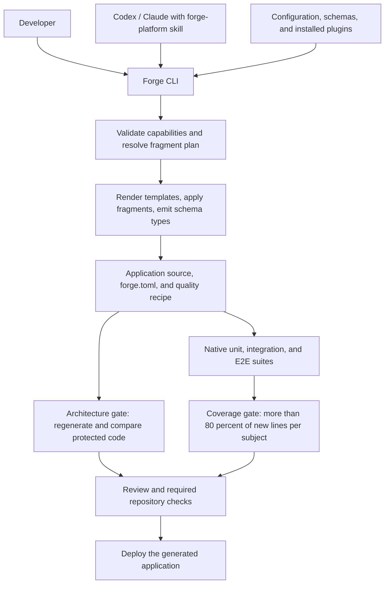
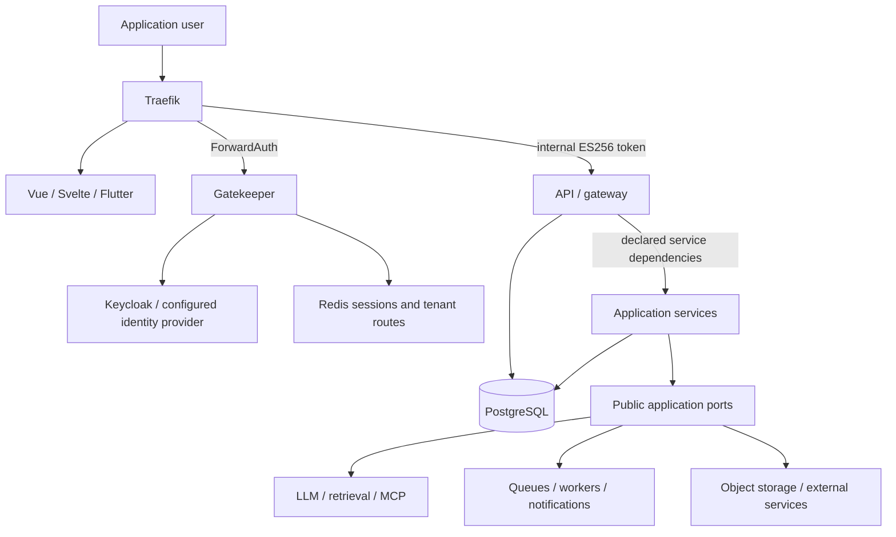

<div align="center">

# forge

*Generate and evolve polyglot services, full-stack applications, and AI platforms.*

[](https://github.com/cchifor/forge)
[](https://www.python.org)
[](LICENSE)
[](https://github.com/cchifor/forge)
[](https://github.com/cchifor/forge/actions/workflows/ci.yml)
[](docs/FEATURES.md)
[](docs/FEATURES.md)
[](docs/FEATURES.md)
[](CONTRIBUTING.md)

</div>

Forge composes application source from configuration, templates, feature fragments,
and schemas. It generates Python, Node/TypeScript, or Rust services with an optional
Vue, Svelte, or Flutter frontend, then records how that source can be validated and
updated. Generated applications run independently of the Forge CLI.

**[Documentation](docs/README.md)** · [Quick start](#quick-start) · [Architecture](#architecture) · [Quality gates](#generated-code-and-quality-gates) · [Agent workflow](#use-with-codex-or-claude)

Current development includes protected generated runtime, ownership-aware updates,
unit/integration/E2E coverage gates, workload-based technology recommendations, and
a shared Codex/Claude skill. The auth-stack rebuild uses
**Gatekeeper as sole token authority** with platform-auth verifier integrations. See the
[changelog](CHANGELOG.md), [auth architecture](docs/auth-architecture.md), and
[upgrade notes](UPGRADING.md#11--12--auth-stack-rebuild-unreleased) for version and
migration details.

## What Forge provides

| Area | Capabilities |
| --- | --- |
| Services | Python/FastAPI, Node/Fastify, Rust/Axum; application scaffolds, CRUD entities, native tests, and Dockerfiles |
| Frontends | Vue, Svelte, Flutter, or no frontend; selectable layouts, API clients, and optional chat/canvas features |
| Platform topologies | Monolithic, microservices, headless API, and multitenant SaaS presets |
| Data and identity | PostgreSQL, schema-generated types, migrations where supported, Gatekeeper/Keycloak auth, service delegation, and tenant isolation |
| AI and tools | Optional LLM providers, tool calling, conversation persistence, retrieval, vector stores, MCP, and typed UI events |
| Operations | Compose, optional Helm output, health checks, tracing, queues, caching, rate limits, and object-storage adapters |
| Lifecycle | Portable generation recipes, file ownership, architecture checks, coverage gates, update previews, and conflict proposals |

Capabilities depend on the selected backend, frontend, features, and plugins.
Use the [option catalog](docs/FEATURES.md), [support matrix](docs/reference/limitations.md),
and a resolved plan to check a combination. Base-framework support does not imply
that every feature or specialized application template exists in every language.

## Architecture

### Generation and validation


```mermaid
flowchart TB
    Human[Developer] --> CLI[Forge CLI]
    Agent[Codex / Claude with forge-platform skill] --> CLI
    Inputs[Configuration, schemas, and installed plugins] --> CLI
    CLI --> Resolve[Validate capabilities and resolve fragment plan]
    Resolve --> Render[Render templates, apply fragments, emit schema types]
    Render --> Project[Application source, forge.toml, and quality recipe]
    Project --> Architecture[Architecture gate: regenerate and compare protected code]
    Project --> Tests[Native unit, integration, and E2E suites]
    Tests --> Coverage[Coverage gate: more than 80 percent of new lines per subject]
    Architecture --> Review[Review and required repository checks]
    Coverage --> Review
    Review --> Deploy[Deploy the generated application]
```

The resolver selects compatible options and orders fragments. Copier templates,
fragment appliers, and schema emitters produce the project. `forge.toml` records
configuration, provenance, ownership, and baselines; `.forge/quality.json` records
the portable recipe and exact generator/plugin identity. Built-ins and plugins
use the same composition pipeline. See [generator internals](docs/architecture/generator.md).

### Generated runtime

This example shows a Gatekeeper-backed service topology. Components are included
according to configuration; a minimal application can omit auth, AI, and other
optional services.


```mermaid
flowchart TB
    User[Application user] --> Edge[Traefik]
    Edge --> UI[Vue / Svelte / Flutter]
    Edge -->|ForwardAuth| GK[Gatekeeper]
    GK --> IdP[Keycloak / configured identity provider]
    GK --> Redis[Redis sessions and tenant routes]
    Edge -->|internal ES256 token| API[API / gateway]
    API -->|declared service dependencies| Services[Application services]
    API --> DB[(PostgreSQL)]
    Services --> DB
    Services --> Ports[Public application ports]
    Ports --> AI[LLM / retrieval / MCP]
    Ports --> Jobs[Queues / workers / notifications]
    Ports --> Storage[Object storage / external services]
```

Gatekeeper manages browser sessions and issues internal tokens; backends verify
those tokens. Service-to-service grants follow declared dependencies. In the
multitenant SaaS preset, a verified tenant claim becomes a transaction-local
PostgreSQL setting used by row-level security. The tenant-management service has
its own control-plane model.

The [platform overview](docs/architecture/overview.md) includes the detailed
authentication, tenant, and AI flow diagrams. Generated Compose credentials and
service secrets are for development; follow the [deployment guide](docs/operations/deployment.md)
for environment-specific configuration, secrets, and trust boundaries.

## Quick start

### Install

Forge requires Python 3.13 or newer and is distributed from GitHub:

```bash
uv tool install git+https://github.com/cchifor/forge.git
forge --version
forge --doctor
```

The [installation guide](docs/guides/getting-started.md#install-and-inspect) also
covers the bootstrap installer. Pin a release or commit for reproducible team
installations. Docker and Compose v2 run the development stack; local generation
and tests may also need the selected Node, Rust, or Flutter toolchains.

### Generate and run

Run `forge` for interactive prompts, or save this example as `stack.yaml`:

```yaml
project_name: shop
backends:
  - name: api
    language: python
    python_version: "3.13"
    features: [items]
frontend:
  framework: vue
  include_auth: false
  include_chat: false
include_keycloak: false
options:
  auth.mode: none
```

Resolve the plan, generate into an explicit destination, then start the stack:

```bash
forge --config stack.yaml --plan --json
forge --config stack.yaml --output-dir ./projects --yes --no-docker --json
cd projects/shop
docker compose up --build
```

`--yes` skips confirmation; `--no-docker` leaves startup to you. Pass
`--output-dir` explicitly because its CLI default can override a config-file
value. For JSON output and path handling, see [agent usage](#use-with-codex-or-claude).
Read the generated service/app READMEs, environment files, and Compose file for
addresses and configuration. Stop a disposable stack with `docker compose down`;
add `-v` when its database and other volumes are disposable too.

A generated project typically contains:

```text
shop/
├── services/api/                 # Backend application, runtime, and native tests
├── apps/frontend/                # Selected frontend and its tests
├── forge.toml                    # Provenance, ownership, and generation baselines
├── .forge/quality.json           # Portable recipe and generator/plugin identity
├── docker-compose.yml
├── .github/workflows/quality.yml
├── .agents/skills/forge-platform/
└── .claude/skills/forge-platform/
```

Selected features add infrastructure, schema output, shared packages, or SDKs at
project or service scope. Continue with [getting started](docs/guides/getting-started.md)
and [customization](docs/guides/customization.md).

## Platform presets

| Preset | Generated shape |
| --- | --- |
| `monolithic` | One Python CRUD service and Vue, without the auth-server stack |
| `microservices` | API gateway, orders and inventory services, Vue, shared auth, and an event bus |
| `headless-api` | API gateway and orders service with shared auth; no frontend |
| `multitenant-saas` | Tenant-management control plane, RLS-isolated application service, Vue, and shared auth |

```bash
forge --platform microservices --project-name commerce --output-dir ./projects --yes --no-docker
```

Built-in platform presets use Python application templates. The generator also
supports mixed-language backends, subject to compatible templates and features.
See [platform presets](docs/guides/platforms.md) for topology, service trust, and
tenant configuration.

## Technology selection

`forge --recommend` applies a deterministic policy to service requirements and
the installed capability registry:

| Service functionality | Starting preference |
| --- | --- |
| CPU-heavy processing, parsing, transformations | Rust/Axum |
| Local AI/ML ecosystems, inference orchestration, RAG | Python/FastAPI |
| Network communication and notifications | Node/TypeScript with Fastify |
| CRUD or remote LLM API calls | Existing compatible runtime; otherwise Python |

Save the [requirements example](docs/guides/technology-selection.md#supply-requirements)
as `requirements.yaml`, then run:

```bash
forge --recommend requirements.yaml --json > recommendation.json
```

Results include reasons, alternatives, rejected candidates, and configurations
for planning. Existing runtimes, team skills, required libraries, and supported
adapters affect the choice; a remote LLM call does not require Python. These
preferences are starting points for measurement, not performance guarantees.

Options are project-wide. When service requirements differ, the recommender
returns separate `service_configs` instead of a combined `config`; their
integration remains explicit. See [technology selection](docs/guides/technology-selection.md).

## Options and frontend composition

Discover the installed surface instead of relying on an old registry snapshot:

```bash
forge --list --format json
forge --describe rag.backend
forge --schema
forge --config stack.yaml --plan --json
```

Set dotted options in the config's `options` map or with repeatable
`--set PATH=VALUE` flags. The [generated option catalog](docs/FEATURES.md) covers
built-ins; CLI discovery also includes installed plugins. Backend, frontend,
database, and agent layer modes determine which parts of a project are emitted.

### Layered components (Vue 3)

Vue's layered component model combines basic components, compositions, and app
templates through data contracts. Contracts can target generated backend slices
or supported bindings to an existing OpenAPI service. Components use the same
fragment pipeline as other features; Vue is the current target for this model.
See [generator architecture](docs/architecture/generator.md#schema-driven-output)
and [ADR-010](docs/architecture-decisions/ADR-010-layered-component-model.md).

App-shell layouts include `sidebar`, `topnav`, `tabbar`, `threepane`, `bento`, and
`docs`; supported combinations are validated by the layout registry. See
[frontend layouts](docs/guides/frontend-layouts.md).

## Use with Codex or Claude

The [canonical forge-platform skill](forge/templates/_common/skills/forge-platform/SKILL.md)
serves both coding agents. Generated projects receive copies under
`.agents/skills/forge-platform/` and `.claude/skills/forge-platform/`, referenced
by their generated `AGENTS.md` and `CLAUDE.md`.

The workflow is: inspect the project and installed capabilities, recommend
technologies when needed, resolve a plan, generate, extend public contracts, then
run architecture, test, and coverage gates. Agents must report the evidence and
remaining failures. They must not change ownership or coverage thresholds to hide
a failing gate. See the [agent guide](docs/guides/agentic-usage.md).

Headless commands support YAML/JSON configs, stdin via `--config -`, and `--json`.
Generation subprocess logs can precede the final JSON envelope; retain logs and
check the process status. Locate output with `project_root` and the quality
inventory, since legacy backend-directory fields can omit `services/`. See the
[CLI reference](docs/reference/cli.md) for output and exit-status details.

Coding-agent skills are separate from the generated application's `agent.mode`:
`none`, `llm_only`, and `tool_calling` depend on backend capabilities;
`multi_agent` is registered but unimplemented.

## Generated code and quality gates

| Ownership | What belongs there | Customization |
| --- | --- | --- |
| `generated` | Generic runtime, shared SDKs/packages, ports, schema output | Change the upstream template/schema/plugin; consume public contracts |
| `scaffold` | Application composition, business logic, tests, configuration | Editable; upstream changes may produce conflict proposals |
| `user` | User-authored modules outside reserved namespaces | Preserved during updates |

Application composition wires custom implementations through public ports.
Generic runtime must not depend on application-specific modules. The architecture
gate independently regenerates the pinned recipe, compares protected output, and
checks supported dependency/patching patterns. Editing local provenance hashes
cannot approve an override. This is a static engineering check, not a sandbox
against arbitrary runtime reflection.

From a generated project:

```bash
forge --quality inventory --project-path .
forge --quality lock --project-path .
forge --quality install --project-path .
forge --quality architecture --project-path .
forge --quality test --project-path .
forge --quality coverage --project-path .
```

`lock` intentionally resolves dependencies; review and commit the lockfiles.
`install` uses frozen dependencies. Unit, integration, and E2E suites must each
execute passing tests and produce fresh, complete evidence. Their **union of
covered lines must exceed 80% of new executable lines for every service, frontend,
and shared package**. Exactly 80% fails; each suite need not independently exceed
80%. Missing, empty, or stale reports fail the gate.

For an existing repository change, use `--base-ref origin/main` after fetching
the base. Coverage uses the merge base and includes local and untracked source
changes. Without a base, all executable source is new; an unavailable supplied
base is an error.

The emitted workflow provides a `generated-quality` check. Configure it as
required in the generated repository and require review of recipe, ownership,
and workflow changes. Workflow generation does not configure GitHub branch
protection. New feature combinations may need test services, auth fixtures,
credentials, and additional application tests before they pass. See the
[quality guide](docs/operations/generated-code-quality.md) for native adapters,
report semantics, and enforcement.

## Update and extend a project

Install the intended Forge version and compatible plugins, then preview and
apply the upgrade from the generated project:

```bash
forge --plan-update --project-path . --json
forge --update --project-path . --json
```

Protected edits and user-file collisions block the update. Untouched scaffolds
can receive upstream improvements; conflicts produce `.forge-merge` proposals
without advancing the generation baseline. Review each proposal, merge it if
needed, then acknowledge `keep` or `replace` through `forge --quality resolve`.
Rerun the update and quality gates. Failed writes restore the previous files.

Projects with a quality recipe reject overwrite and partial-template modes.
Legacy projects retain older merge semantics until reviewed migration;
`forge --quality migrate --project-path .` produces a read-only adoption proposal.
Topology and schema changes must keep config, recipe, manifest, and test inventory
consistent. Follow [customization and upgrades](docs/guides/customization.md).

Plugins register options, fragments, and other extensions through `forge.plugins`
and the public SDK. [Harvest](docs/architecture/round-trip.md) can propose eligible
application changes for upstream review; it does not authorize protected runtime
edits. See [plugin development](docs/guides/plugins.md) and the
[SDK changelog](docs/SDK_CHANGELOG.md).

## Project status

This README describes the checked-in development version. Release history and
migration requirements live in [CHANGELOG.md](CHANGELOG.md) and [UPGRADING.md](UPGRADING.md).

| Implemented area | Validation and detail |
| --- | --- |
| Auth-stack rebuild | Gatekeeper authority, BFF sessions, internal ES256 tokens, service delegation; [auth contract](docs/auth-architecture.md) |
| Cross-SDK parity contract | Python/Node/Rust authentication behavior checked by [contract tests](tests/contract/auth_sdk_parity/) |
| Generated-code gates | Windows/Linux policy checks and selected Python, Node, Rust, Vue, and Svelte native configurations in [CI](.github/workflows/generated-quality.yml) |
| Generator and rendered projects | OS tests, generation/toolchain matrices, Compose smoke, and round-trip lanes; [validation matrix](docs/operations/validation-matrix.md) |

**`auth.mode`** selects the auth architecture supported by the chosen configuration;
use the [1.2 upgrade guide](UPGRADING.md#11--12--auth-stack-rebuild-unreleased)
when migrating from the older Keycloak-direct model.

The [capability limits](docs/reference/limitations.md) are part of the platform
contract. OpenAI adapters exist for Python/Node/Rust; Anthropic, Ollama, Bedrock,
RAG, and platform MCP adapters currently target Python. Feature and component
parity varies. Browser quality tests do not establish a complete deployed
login/tenant journey. Flutter's LCOV adapter exists, but native device/E2E coverage was not
validated in the generated-quality rollout. Static analysis is not coverage
evidence. Generator coverage follows its separate [coverage policy](docs/coverage-policy.md).

Proposed work, ADRs, RFCs, and dated implementation reviews are indexed in
[plans and decisions](docs/plans/README.md). A proposal is not a shipped capability
or a committed release date.

## Documentation

Start at [docs/README.md](docs/README.md) for task-based navigation.

| Section | Contents |
| --- | --- |
| [Architecture](docs/architecture/README.md) | Platform, generator, authentication/data flows, round-trip model |
| [Guides](docs/guides/README.md) | Manual and agent usage, technology selection, presets, customization, plugins |
| [Reference](docs/reference/README.md) | CLI, options, supported capabilities, MCP, telemetry |
| [Operations](docs/operations/README.md) | Architecture/coverage gates, deployment, troubleshooting, maintainer runbooks |
| [Plans and decisions](docs/plans/README.md) | Preserved ADRs, RFCs, and dated implementation evidence |

## Contributing and support

```bash
git clone https://github.com/cchifor/forge.git
cd forge
uv sync --locked --dev
uv run pre-commit install
make check
```

Read [CONTRIBUTING.md](CONTRIBUTING.md) and [maintainer onboarding](docs/guides/maintainer-onboarding.md).
Changes to generated output need rendered application validation in addition to
generator tests. Keep documentation and the generated option catalog aligned with
the implementation; do not append AI co-author or session trailers to commits.

Use the [issue tracker](https://github.com/cchifor/forge/issues) for reproducible
bugs and feature requests, or consult [troubleshooting](docs/operations/troubleshooting.md).
Report vulnerabilities through the [security policy](SECURITY.md).

## Authors and license

Created and maintained by [Constantin Chifor](https://github.com/cchifor).
Forge builds on Copier, Jinja2, the selected application frameworks, and the
libraries documented in its templates and dependencies. Licensed under the
[MIT License](LICENSE).
