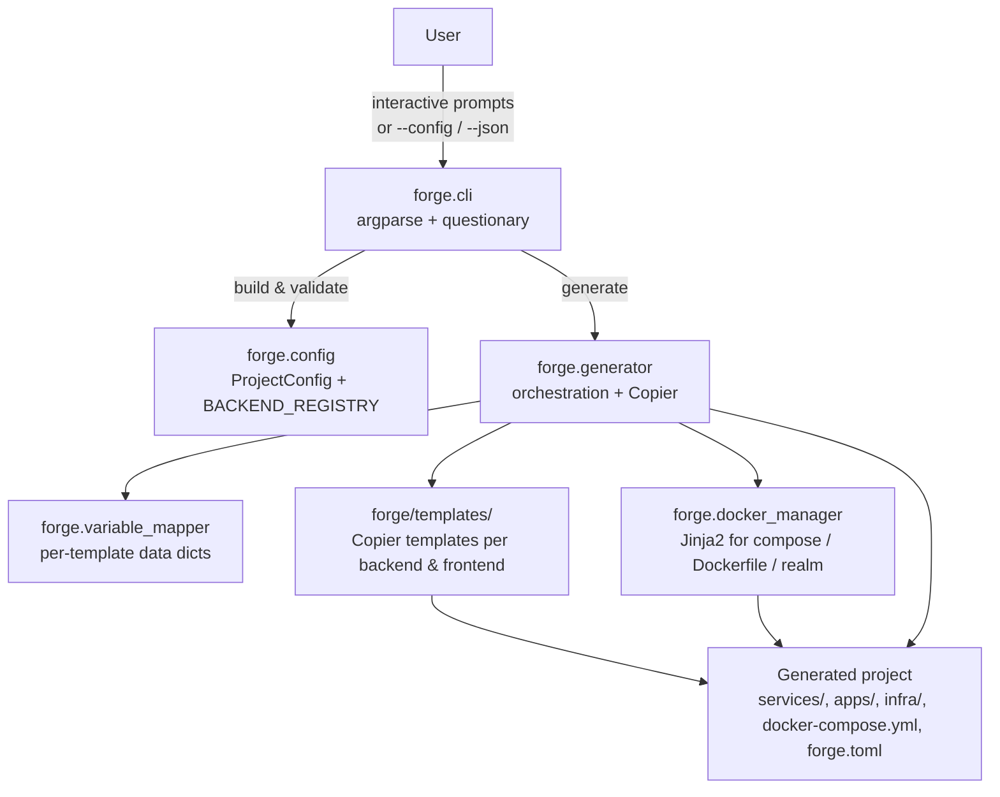

# Forge architecture

Forge is a thin orchestration layer over Copier templates. Most of its job is mapping a single user-provided `ProjectConfig` into the per-template Copier data dicts and stitching the rendered outputs into one cohesive project (shared `docker-compose.yml`, unified git repo, multi-backend init script).

## High-level flow



## Module responsibilities

| Module | Responsibility |
|--------|---------------|
| `forge/cli.py` | Argument parsing, interactive prompts, headless config loading, error routing (JSON envelope vs stderr+exit). Entry point: `main()`. |
| `forge/config.py` | Pure dataclasses (`BackendConfig`, `FrontendConfig`, `ProjectConfig`) and the `BACKEND_REGISTRY` that drives language-specific behavior. `validate()` is split into `_validate_features_against_reserved`, `_validate_ports`, `_validate_keycloak_ports`. |
| `forge/generator.py` | Orchestrates Copier invocations, post-generation setup (`uv sync`, `npm install`, `cargo build`), git init, and `forge.toml` stamping. Surfaces failures via `GeneratorError`. |
| `forge/variable_mapper.py` | Single `backend_context()` for all three languages (driven by `BACKEND_REGISTRY`); per-framework frontend context builders that diverge enough to stay separate. |
| `forge/docker_manager.py` | Jinja2-renders production `docker-compose.yml`, frontend `Dockerfile`, `nginx.conf`, `init-db.sh`, and `keycloak-realm.json` (the realm is JSON-validated before write). |
| `forge/templates/` | Copier templates: `services/{python,node,rust}-service-template`, `apps/{vue,svelte,flutter}-frontend-template`, `tests/e2e-testing-template`, `infra/{gatekeeper,keycloak}`. |

## Error model

Anything that breaks generation raises `GeneratorError` (defined in `forge.generator`). `cli.main()` catches it once and routes to either:
- `_json_error()` for `--json` mode → single-line `{"error": "..."}` on stdout, exit 2.
- stderr + `sys.exit(2)` otherwise.

This keeps stack traces out of agent-facing JSON envelopes while preserving them in tests via `GeneratorError`'s `__cause__`.

## Reliability invariants

- `_run_backend_cmd(..., required=True)` raises `GeneratorError` on timeout, missing tool, or non-zero exit. Default `required=False` keeps best-effort behavior for setup tasks.
- `_git_init` runs each git step (init, add, commit) under `check=True`. A failed commit no longer leaves a project with a half-initialized repo.
- `render_keycloak_realm` parses the rendered JSON and asserts essential top-level keys before writing — a Jinja typo fails generation immediately, not at Keycloak boot.

## Generated project layout

```
<project_slug>/
├── forge.toml                 # forge_version + per-language template paths (WS6)
├── docker-compose.yml         # all services wired up
├── init-db.sh                 # multi-backend / keycloak DB bootstrap
├── services/
│   ├── <backend-1>/           # Copier-rendered (Python/Node/Rust)
│   ├── <backend-2>/
│   └── ...
├── apps/
│   └── <frontend>/            # Copier-rendered (Vue/Svelte/Flutter)
├── infra/                     # only when --include-auth
│   ├── keycloak-realm.json
│   ├── gatekeeper/
│   └── keycloak/
└── tests/e2e/                 # Copier-rendered Playwright suite
```
