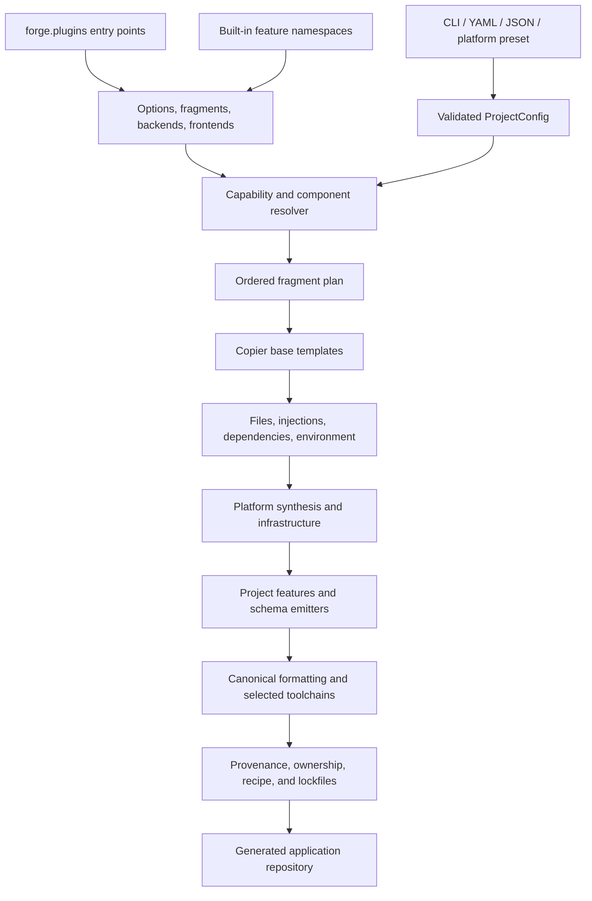
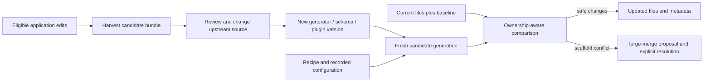

# Generator architecture

The generator composes Copier templates, feature fragments, schema emitters,
and shared runtime into a project. It records the inputs and output ownership
so later updates can distinguish upstream runtime from application changes.
The generated services do not depend on the Forge CLI at runtime.

## Composition model

Plugins and built-ins participate in the same registries and pipelines. The live
registry is the source of truth for counts and compatibility; inspect it with
`forge --list --format json`, `forge --describe OPTION`, and `forge --schema`.
For an actual project, `forge --config stack.yaml --plan --json` resolves defaults,
dependencies, conflicts, target backends, and selected components before rendering.

## Source map

| Responsibility | Source |
| --- | --- |
| CLI parser, config loading, dispatch | [`forge/cli/`](../../forge/cli/) |
| Project, backend, frontend, typed layer configuration | [`forge/config/`](../../forge/config/) |
| Typed option registry | [`forge/options/`](../../forge/options/) |
| Feature registration and colocated templates | [`forge/features/`](../../forge/features/), [`feature_loader.py`](../../forge/feature_loader.py) |
| Fragment contracts and registry | [`forge/fragments/`](../../forge/fragments/) |
| Capability and component resolution | [`capability_resolver.py`](../../forge/capability_resolver.py), [`components/`](../../forge/components/) |
| Top-level generation and platform synthesis | [`generator.py`](../../forge/generator.py), [`synthesis/`](../../forge/synthesis/) |
| Fragment application and injection | [`appliers/`](../../forge/appliers/), [`injectors/`](../../forge/injectors/) |
| Schemas and language emitters | [`codegen/`](../../forge/codegen/), [`domain/`](../../forge/domain/) |
| Provenance, legacy merge, harvest, and migrations | [`sync/`](../../forge/sync/), [`migrations/`](../../forge/migrations/) |
| Ownership, independent regeneration, updates, coverage | [`quality/`](../../forge/quality/) |
| Workload recommendations | [`recommend.py`](../../forge/recommend.py) |
| Plugin discovery and public SDK | [`plugins.py`](../../forge/plugins.py), [`api.py`](../../forge/api.py) |

## Registries and fragments

An `Option` has a dotted path, type, default, allowed values, compatibility
metadata, and value-to-fragment mappings. A `Fragment` declares dependencies,
conflicts, target scopes, and per-backend implementations. The resolver expands
the graph, rejects incompatible choices, and topologically orders application.
Backend/frontend registries select base templates and toolchain metadata.

Built-in features colocate options, fragment definitions, and their template
trees under `forge/features/<namespace>/`. Plugins register through the
`forge.plugins` Python entry-point group and provide their own package-relative
resources. Registry validation applies to both; missing required codegen output
is a generation failure, including selected plugin emitter failures.

Fragments can copy files, apply `inject.yaml` snippets, add dependency entries,
append environment declarations, and contribute infrastructure snippets.
Python uses LibCST-aware insertion; JavaScript/TypeScript supports its configured
AST/marker path; other formats use marker-based text insertion. Sentinel blocks
allow repeated application and historical merge/harvest tracking.

Injection zones (`generated`, `user`, `merge`) are a fragment-level mechanism.
They are distinct from file ownership (`generated`, `scaffold`, `user`). In a
recipe-managed project, the ownership transaction protects the entire generated
boundary before applying an update; a permissive legacy injection zone cannot
approve a customized protected file.

## Generation phases and reproducibility

[`_run_generation_phases`](../../forge/generator.py) resolves the plan, renders
backends and the frontend, synthesizes supported service relationships, renders
infrastructure, then applies project features/common files and schema outputs.
It canonicalizes source formatting, runs selected toolchains, reconciles Python
migration chains, refreshes modified manifest hashes, and finalizes metadata.

`forge.toml` records configuration, options, provenance, merge baselines, and
per-file ownership. `.forge/quality.json` records the portable configuration,
generator version, exact install requirement, source fingerprint, and plugin
versions. Dependency lockfiles describe the emitted applications' dependencies;
they serve a different purpose from the generator identity pin.

Architecture validation renders the pinned recipe independently and compares
protected output. Editing local hashes is insufficient to approve a runtime
override. A recipe made from uncommitted generator changes is useful locally
but must be regenerated from a published commit before CI can reproduce it.

## Schema-driven output

| Input | Output or consumer |
| --- | --- |
| Shared UI protocol JSON Schemas | TypeScript, Dart, and Python event/type models |
| Canvas props schemas and component contracts | Canvas manifest, validation/types, selected frontend contract bindings |
| Shared domain enum YAML | Matching language representations for selected backends/frontends |
| Project `domain/*.yaml` entities | Python DTO/ORM/migration outputs, Node Zod schemas, Rust structs, OpenAPI schemas |
| TypeSpec bridge | Optional domain-spec conversion through an available TypeSpec toolchain |
| Frontend OpenAPI binding configuration | Validated operation bindings and constrained field/coercion transforms |

These pipelines do not imply full parity of domain features across languages.
For example, the Node entity emitter's Zod output is not a promise of automatic
Prisma schema/migration generation for every domain edit. Review the emitter and
its tests for the contract you are extending. Project-local schema/topology
changes also need to remain consistent with the portable generation recipe;
do not assume an older incremental helper performs a complete ownership
migration. See [customization](../guides/customization.md#legacy-projects-and-topology-changes).

The Vue layered component model has basic components, compositions, and app
blueprints. Selected components become project-scoped fragments and use the same
application pipeline. Contracts support generated backend slices or a binding to
an existing OpenAPI service. Vue is the current layered-component target; having
Vue, Svelte, and Flutter base templates does not establish layered-component
parity. [ADR-010](../architecture-decisions/ADR-010-layered-component-model.md)
records the design; [frontend layouts](../guides/frontend-layouts.md) explains
application shell variants.

Canvas runtime packages live in [`packages/`](../../packages/) and are copied or
referenced locally in generated projects according to the target. They do not
require the backend to import the Forge CLI or a hypothetical public registry
release. Distribution and package naming proposals are recorded separately in
[RFC-003](../rfcs/RFC-003-package-naming.md).

## Update and reverse flow

With `.forge/quality.json`, `--plan-update` and `--update` share a transaction:
protected edits and unsafe paths block it, unmodified scaffolds may update,
customized scaffolds may produce proposals, and failed writes roll back. A
conflict leaves the generation baseline unchanged. Public contracts keep user
behavior outside the replaceable runtime.

Without a recipe, the legacy updater uses file/zone merge semantics and its
`merge`, `skip`, or `overwrite` modes. Those modes are not a bypass for protected
projects. Migration is explicit and reviewable. See the
[quality contract](../operations/generated-code-quality.md) for exact checks and
[round-trip invariants](round-trip.md) for harvest's scope and limitations.

## Validation layers

Forge itself has unit/integration, lint/type, packaging, contract, mutation,
and rendered-project workflows. Generated applications have their own native
suites and architecture/coverage workflow. A passing generator unit test does
not prove a rendered service boots; a successful build does not prove that an
E2E suite ran. The [validation matrix](../operations/validation-matrix.md),
[generator coverage policy](../coverage-policy.md), and
[generated-code gates](../operations/generated-code-quality.md) define these
separate evidence layers.
