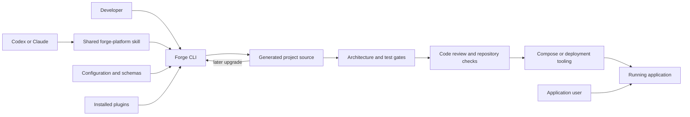
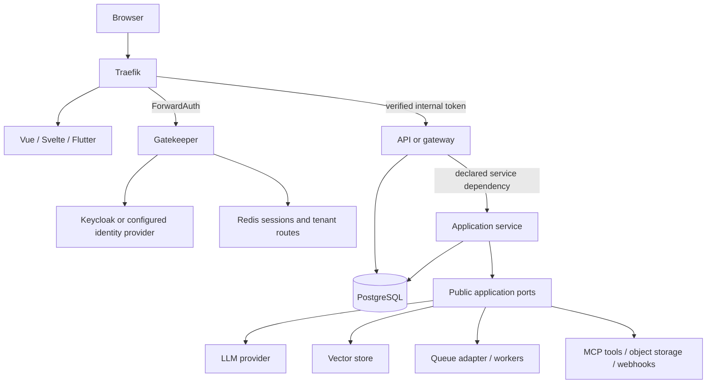
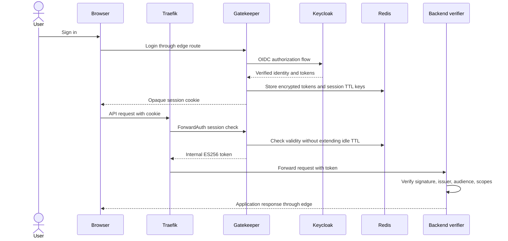
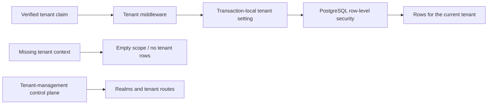
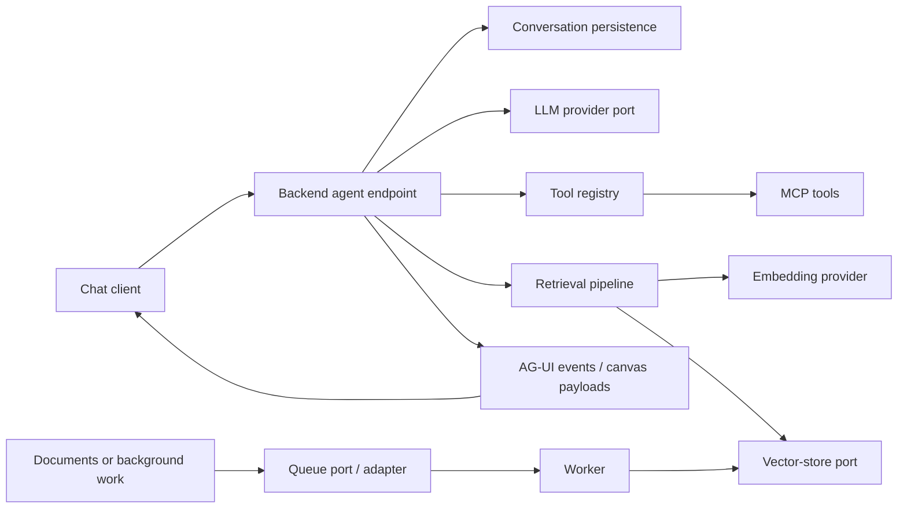

# Platform overview

Forge has two roles: a Python CLI that composes projects, and the application
source it generates. The generated project owns its deployment and runs without
the Forge CLI in the request path. Forge is used again to inspect, validate,
extend, and upgrade that source.

## What the platform provides

| Area | Checked-in capability | Main extension point |
| --- | --- | --- |
| Services | Python/FastAPI, Node/Fastify, Rust/Axum; CRUD entities, tests, migrations, Dockerfiles | Application composition and public ports |
| Frontends | Vue, Svelte, Flutter; selectable shells, API clients, optional chat | Application pages/components and public shared runtime |
| Platform topology | Monolithic, microservices, headless API, multitenant SaaS presets | Backend list, application templates, declared dependencies |
| Data | PostgreSQL; schema-driven entities and shared types; optional tenancy | Entity schemas and repository/service contracts |
| Auth | Gatekeeper/Keycloak stack, verifier SDKs, service delegation, BFF sessions | Supported auth provider and scope/tenant configuration |
| AI and tools | Optional LLM, agent, RAG, MCP, and canvas features | LLM/vector/tool ports and feature registry |
| Reliability and operations | Optional queues, caching, telemetry, rate limits, health, object storage | Options and backend-specific adapters |
| Lifecycle | Provenance, ownership, regeneration, conflict proposals, coverage gates | Reviewed generator/schema/plugin changes |

Features vary by backend and frontend. Consult the [live option
catalog](../FEATURES.md), [support limits](../reference/limitations.md), and
the resolved plan; the table does not promise that every combination exists.

## System context

The same command surface serves manual and agent workflows. An agent skill
provides instructions; it does not bypass configuration validation, source
ownership, or CI. Selecting `agent.mode` configures an application's runtime AI
features and is a separate concern from using a coding agent to operate Forge.

## Generated runtime

This diagram shows the Gatekeeper-backed multi-service shape. A minimal project
omits components it did not select; a headless project has no frontend.

`services/<name>/` contains each backend, `apps/<frontend>/` the selected client,
and `infra/` deployment/auth material. Shared runtime may live in `packages/`
or `sdks/`, depending on the selected feature. Each backend builds its own image;
Compose connects the images and supporting services. Optional Helm output is
topology-aware; it still requires environment-specific deployment configuration.

The built-in multi-service presets use Python application templates. The core
generator also supports mixed-language backends; changing a preset's language
requires a compatible application template and options. A language badge is not
a guarantee that every specialized template has an equivalent implementation.

## Browser request and authentication flow

Gatekeeper is the sole internal token authority for this configuration.
Backends verify its tokens; they do not directly accept the upstream Keycloak
token. Python delegates its verifier integration to Weld libraries; Node and
Rust use the emitted platform-auth SDKs. Explicit user activity refreshes the
idle session through `/auth/session`; background API traffic does not extend it.
See the [auth contract](../auth-architecture.md) for two-key Redis TTL behavior,
JWKS caching, session timeout, and on-behalf-of token exchange.

When service discovery is enabled, backend `depends_on` edges produce registry
grants and internal URLs. A service obtains a scoped token from Gatekeeper before
calling an allowed peer. This is generated configuration, not automatic discovery
of arbitrary services at runtime. Development service secrets are deterministic
and must be replaced for deployment.

## Tenant data isolation

The `multitenant-saas` preset uses `database.multitenancy=shared_rls` and
`database.tenant_resolution=token_claim`. The app binds the verified tenant to
`app.current_tenant` for the transaction. The tenant-management service is exempt
from the application RLS fragment and uses its separate control-plane model.
This pattern requires the correct database role, policies, and transaction
boundaries; validate tenant-isolation journeys for the deployment you operate.

## AI, retrieval, and asynchronous work

This is the optional rich feature path, primarily supported by the Python
backend. Schema-generated UI events and canvas contracts keep client/backend
types aligned. It is distinct from autonomous coding-agent orchestration:
`agent.mode=multi_agent` is registered but rejected as unimplemented.
For notifications and other jobs, the queue backend supplies transport;
application logic still needs idempotency, bounded retries, delivery policy,
and failure handling. See [technology selection](../guides/technology-selection.md).

## Generation and upgrade boundary

Reusable runtime, shared SDKs, and schema outputs are protected generated code.
Business behavior belongs in editable application scaffolds and custom modules
registered through public ports. [Generator internals](generator.md) explains
how these pieces are emitted; [customization](../guides/customization.md) and
[quality gates](../operations/generated-code-quality.md) explain how to evolve
them without losing the ability to regenerate.
