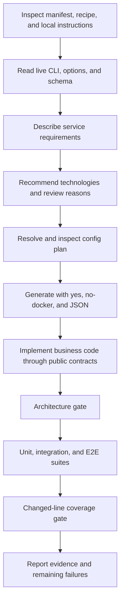

# Operate Forge with Codex or Claude

Use the same [canonical forge-platform skill](../../forge/templates/_common/skills/forge-platform/SKILL.md)
for both coding agents. In this repository, the `.agents` and `.claude` skill
entry points resolve to that source. Generated projects receive copies at:

```text
.agents/skills/forge-platform/SKILL.md
.claude/skills/forge-platform/SKILL.md
```

Generated `AGENTS.md` and `CLAUDE.md` point to the skill. Update the canonical
source when contributing skill changes; keep emitted copies aligned through
generation rather than editing two independent instruction sets.

## Headless workflow



1. Inspect `forge.toml`, `.forge/quality.json`, repository instructions, and the
   installed Forge version before changing an existing project.
2. Discover the actual surface with `forge --help`, `forge --list --format json`,
   and `forge --schema`. Plugins and backend support affect available options.
3. If language choice is open, run `forge --recommend requirements.yaml --json`.
   Follow [technology selection](technology-selection.md), including separate
   configs for incompatible project-wide option requirements.
4. Validate with `forge --config stack.yaml --plan --json`. Generate with
   `forge --config stack.yaml --yes --no-docker --json` only after the plan
   represents the requested service functionality.
5. Keep business logic outside protected namespaces and compose it through public
   ports. Run the architecture gate, all required suites, and the coverage gate.
6. Report changed files, test commands actually executed, coverage by subject,
   and unresolved failures. Compilation and skipped tests are not passing suites.

Configuration can arrive on stdin without a temporary file:

```bash
forge --config - --yes --no-docker --json <<'CONFIG'
{
  "project_name": "agent-demo",
  "backends": [{"name": "api", "language": "python", "features": ["items"]}],
  "frontend": {"framework": "none"},
  "options": {"auth.mode": "none"}
}
CONFIG
```

Capture logs and process exit status separately. Some generation subprocesses
(Copier tasks and native tools) write progress to stdout before the final JSON
envelope even with `--json`; do not assume the entire stream is one JSON document.
Retain the complete log and extract the final envelope only after process
completion. Planning, recommendation, and quality commands provide the simpler
structured interfaces for automation. JSON payloads vary by command;
use `project_root` plus the manifest/quality inventory to locate generated
subjects (legacy backend path fields can omit `services/`), check `passed`
where provided, and never treat a nonzero exit as success just
because a result file exists. Quality commands return exit 12 on a failed gate;
other command families have their own [exit statuses](../reference/cli.md#exit-status).
Keep credentials in environment variables or secret stores, outside configs and
recipes. Discovery and recommendation do not need model-provider credentials.

## Updating existing projects

Use `--plan-update` before `--update`. For a recipe-managed project, inspect each
`.forge-merge` proposal and acknowledge it with `--quality resolve --subject
RELATIVE_FILE --resolution keep` or `replace`; then rerun the update. The
interactive legacy `--resolve` requires a terminal and is unsuitable for a
headless run. See the [customization guide](customization.md#upgrade-flow).

An agent must not lower coverage thresholds, alter ownership to hide protected
edits, import private runtime internals, or regenerate provenance hashes to
approve an override. When a required capability is missing, change the upstream
schema/template/plugin or propose an explicit public extension. Document the
limitation instead of claiming an unsupported combination passed.

## Coding agents versus application agents

This guide concerns agents that develop with Forge. Runtime `agent.mode`, LLM
providers, RAG, tool calling, and MCP are generated application features with
separate capability requirements. `agent.mode=multi_agent` is registered for
future compatibility but is not implemented. See the
[platform AI flow](../architecture/overview.md#ai-retrieval-and-asynchronous-work).
