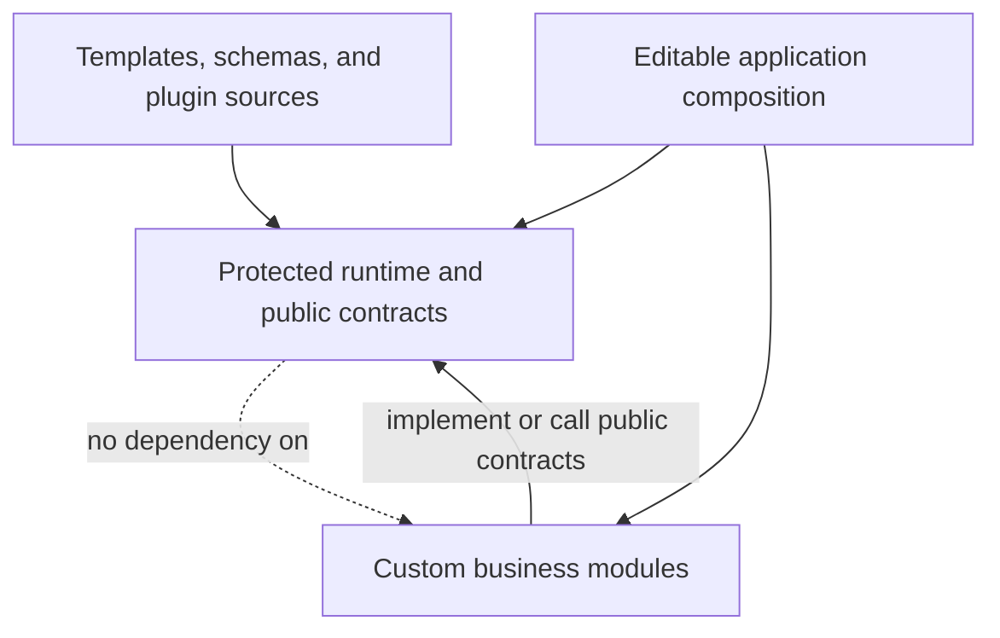
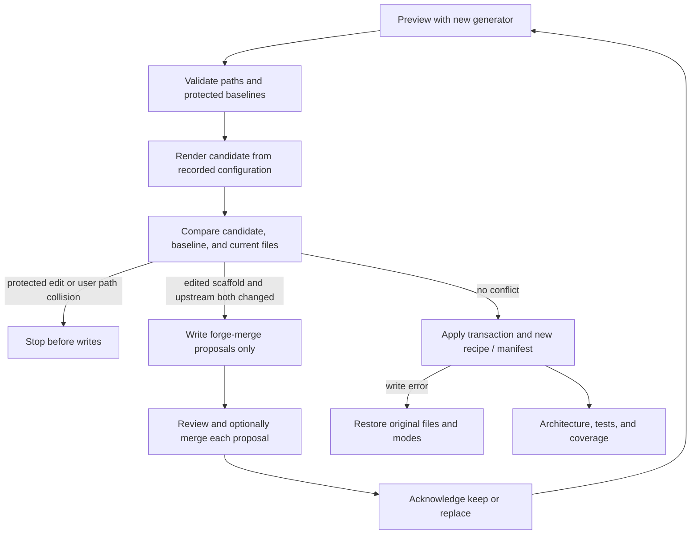

# Customize and upgrade generated projects

The durable customization boundary is public contracts plus application
composition. Keep reusable generated runtime intact so an upstream generator
or schema change can replace it safely.

## Ownership and dependencies

| Ownership | Typical files | Where changes belong |
| --- | --- | --- |
| `generated` | Core runtime, middleware, ports, shared packages/SDKs, schema output, feature runtime | Upstream template/schema/plugin, or a public extension implemented elsewhere |
| `scaffold` | Application entry points, business routes/services/models, tests, configuration, migrations | Editable application code; compose custom implementations here |
| `user` | User-authored files and eligible harvested scaffolds | User-controlled modules outside reserved generated namespaces |

The recipe and manifest identify the concrete ownership of each path. Origin
(`base-template`, `fragment`, `user`, etc.) answers where a file came from;
ownership answers who may change it. They are separate concepts.



The dotted edge is a prohibited dependency direction: shared generated runtime
must not import application-specific custom modules. The composition root wires
both together. Avoid private implementation imports, monkey patching, and
shadow files in generated namespaces. A local manifest hash edit cannot approve
an override because the architecture gate independently regenerates the recipe.

## Backend extension points

- **Python:** place a Dishka `Provider` under `app/custom/` and pass it through
  `create_app(providers=[YourProvider()])` from application composition. The
  generated lifecycle keeps its default providers and manages the combined
  container. Implement the public port contract your service needs.
- **Node:** register application Fastify plugins on the returned app before
  listening; keep registration in scaffold/application files.
- **Rust:** compose the returned Axum router from the application entry point.
- **Frontends:** put product pages and behavior in editable application files;
  consume the public shared runtime and generated types instead of copying or
  overriding their internals.

The [architecture gate](../operations/generated-code-quality.md) checks supported
static dependency and ownership patterns. It is an engineering guard, not a
sandbox or proof against arbitrary runtime reflection.

## Upgrade flow

Commit or otherwise preserve your current application and inspect the release's
[upgrade notes](../../UPGRADING.md). Install the intended Forge version and its
compatible plugins. An ordinary architecture check requires the exact recorded
source identity; an intentional update regenerates with the selected new version.

```bash
forge --plan-update --project-path . --json
forge --update --project-path . --json
```



Untouched scaffolds can receive upstream changes. Edited scaffolds remain yours;
when upstream also changes them, Forge writes `<path>.forge-merge` and returns
nonzero without advancing the generation baseline. Review the proposal and, if
needed, merge it into the current file, then acknowledge:

```bash
forge --quality resolve --project-path . --subject services/api/pyproject.toml --resolution keep
forge --update --project-path . --json
```

`keep` retains the current file, including any manual merge; `replace` takes the
proposal verbatim. Both acknowledge the proposed upstream baseline. Repeat for
every conflict before updating again. The path above is an example; use paths
reported for your project. Missing owned files are restored during update;
customized files that newly collide with protected output block the transaction.

Recipe-managed updates reject partial-template and overwrite modes. A successful
write is followed by architecture and native test/coverage checks before merging
the upgrade. Review recipe, workflow, and ownership changes as infrastructure
changes, because those files determine what the gates trust.

## Legacy projects and topology changes

```bash
forge --quality migrate --project-path .
```

Migration is a read-only proposal. Regenerate the original configuration into a
separate directory, move custom changes into extension files, and adopt the
reviewed recipe and manifest together. Do not delete provenance or adopt modified
generic runtime as its own baseline. Legacy projects without a recipe keep their
older zone/file merge behavior until this migration is completed.

Treat a new backend or a changed topology as a reviewed configuration migration.
The older `--add-backend-language` helper only scaffolds a service; it does not
perform the complete recipe, service registry, Compose, frontend route, and
coverage-inventory migration. For a protected project, validate a full revised
config and compare a fresh generation in a separate directory before adopting
it. Keep the manifest, recipe, services, and test inventory consistent.

## Contribute an improvement upstream

[Harvest and round-trip tools](../architecture/round-trip.md) can propose eligible
fragment changes from a project. A candidate still requires review in Forge or
the owning plugin; harvest does not authorize local edits to protected code.
Changes to generic runtime should be made in its source template/schema and
validated in rendered applications before consumers update.
