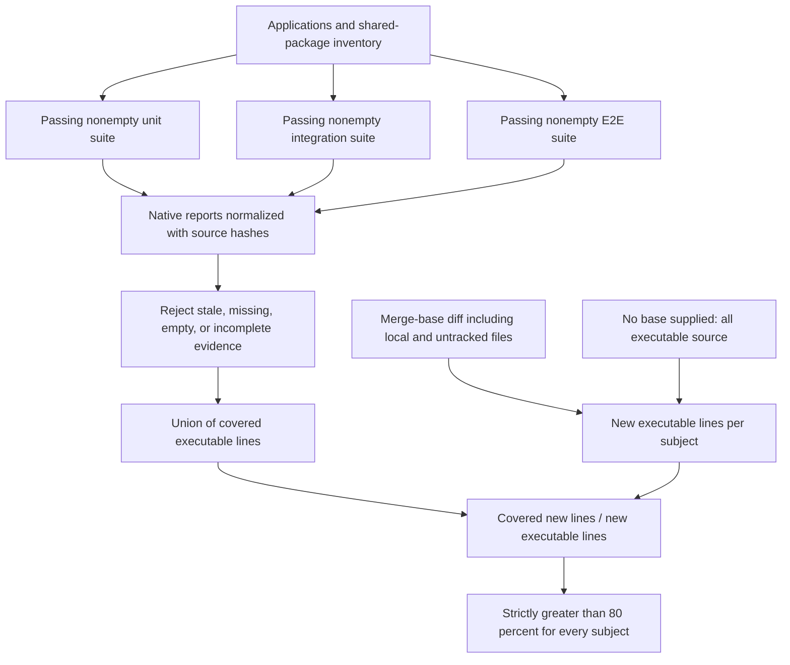

# Generated-code quality gates

These gates protect the output of Forge. They are separate from the
[generator repository's coverage policy](../coverage-policy.md). For a first
application, start with [getting started](../guides/getting-started.md); for
custom behavior and upgrades, use [customization](../guides/customization.md).

Every new project records a portable recipe in `.forge/quality.json` and
per-file ownership in `forge.toml`. Legacy origins remain intact. Use
`forge --quality migrate --project-path PROJECT` to propose ownership for an
older project; edited files require review before adoption.

## Ownership and extension boundaries

- **generated**: shared SDKs/packages, shared frontend runtime, core runtime, middleware, ports,
  schema-generated output and feature runtime. Change the generator/schema;
  extend it through public contracts.
- **scaffold**: application composition, business services/models/routes,
  tests, configuration and migrations. Unmodified files can receive upstream
  improvements; edited files are preserved or receive a conflict proposal.
- **user**: user-authored files and harvested scaffolds are preserved.
  A user file colliding with a new protected path blocks the update.

`forge --quality architecture --project-path .` regenerates the pinned recipe
and compares protected bytes against that independent output. Local provenance
hash edits cannot approve an override. It rejects missing/changed protected
files, added files in reserved generated namespaces, private implementation
imports, generated-to-custom dependencies, and direct Python module patching.
The source fingerprint prevents running a different generator by accident.
This is a static engineering gate; it does not prove the absence of arbitrary
reflective runtime behavior. Public dependency injection remains the extension
mechanism. New files should live outside reserved generated namespaces.

For Python, put a Dishka `Provider` in `app/custom/` and compose it with
`create_app(providers=[YourProvider()])`; the generated lifecycle keeps its
defaults and manages the combined container. In Node, register application
Fastify plugins on the returned app before listening. In Rust, compose the
returned Axum router from the application entry point. Keep these registrations
in scaffold/application files and implement the published port contracts.

For Vue and Svelte, explicit `npm run codegen` writes service-specific OpenAPI
SDKs or types to `src/custom/api/`. Application code can import this output without
overwriting Forge-owned generic API and feature types. The development server
does not run client generation automatically. Keep custom client generation in
this extension directory; writing its output into a protected namespace fails
the architecture gate. The usual testing and coverage requirements still apply.

The generated workflow installs the recorded release or Git commit. Treat
recipe, workflow and generator upgrades as reviewed infrastructure changes.
A recipe produced from an uncommitted generator checkout is for local
development: publish the generator commit and regenerate before using CI.
External plugins must also be installed at the recipe's recorded versions.
Built-in and selected plugin codegen failures stop generation. A plugin may
still log diagnostic information from its sibling emitters before the failure
is returned; partial output is never success.

## Updates

`forge --plan-update --project-path . --json` previews the same transaction
used by `forge --update`. Protected edits and path/symlink escapes stop the
operation before writes. Missing owned files are restored. A failed write
restores original files. Conflicts produce `.forge-merge` files and leave
the generation baseline unchanged; the command exits nonzero.

Review each proposal, optionally merge it into the current file, then run:

```sh
forge --quality resolve --project-path . --subject services/api/pyproject.toml --resolution keep
forge --update --project-path . --json
```

Use `replace` to accept the proposal verbatim. Both choices acknowledge the
new upstream baseline. Ownership-managed updates reject partial-template and
overwrite modes because these cannot maintain the recorded recipe.
Legacy projects retain the previous update semantics until migration.

## Coverage gate



```sh
forge --quality inventory --project-path .
forge --quality lock --project-path .       # intentional dependency resolution
forge --quality install --project-path .    # frozen dependency installation
forge --quality architecture --project-path .
forge --quality test --project-path .       # unit, integration, E2E
forge --quality coverage --project-path . --base-ref origin/main
```

Omit the base for a fresh project: every executable source line is new.
For a change, the gate uses the Git merge base and includes local changes and
untracked source files. An unavailable base is an error, never a full-coverage
fallback. A change with no executable lines reports a zero denominator.

Coverage is the **union of covered lines**, deduplicated across suites,
strictly **greater than 80%** per service/frontend/shared package. Exactly
80% fails. Each required suite must execute a passing test and produce fresh
source-hashed evidence. Missing, stale, duplicate, empty and incomplete
reports fail. Shared runtime coverage is attributed independently from its
consumer suites. Total and per-suite results are reported alongside changed
line coverage; branch coverage collected by native tools is supplementary.
The gate does not require each individual suite to exceed 80% independently.
For example, unit and integration suites can exercise different lines; a line
covered in both counts once in the combined numerator. Every suite still has
to execute successfully, even if another suite already covers those lines.

Adapters use coverage.py for Python, Vitest/V8 for Node and frontend unit/
integration tests, instrumented Playwright browser coverage for Vue/Svelte,
cargo-llvm-cov for Rust, and Flutter LCOV. Python SDKs are installed editable
so tests measure the actual vendored sources. This does not permit editing
protected files. Rust and Node integration suites require a disposable
PostgreSQL database through `DATABASE_URL`. Flutter E2E runs on Linux by
default (`FORGE_FLUTTER_DEVICE` can select another device).

Frontend browser tests exercise the generated UI in a real Chromium process.
They do not claim to validate a deployed backend/authentication stack. Add
full-stack user journeys for the selected services and authentication mode.

New feature combinations may require additional fixtures, credentials from a
test issuer, or external test services. The gate fails until that combination
has passing suites and sufficient coverage; unsupported or empty suites never
count as success. Credentials belong in CI secrets/environment, not recipes.

### What has been exercised

The repository's [generated-quality workflow](../../.github/workflows/generated-quality.yml)
runs policy/acceptance checks on Windows and Linux and rendered native gates
for Python, Node, Rust, Vue, and Svelte on Linux. These lanes exercise selected
configurations, not every possible option cross-product. Other workflows cover
generation matrices, platform boot, authentication contracts, and frontend
analysis/builds.

The Flutter LCOV adapter and device selection exist, but the native
device/E2E coverage path was not validated in the generated-quality rollout
([PR #350](https://github.com/cchifor/forge/pull/350)). Flutter static analysis
passing is not evidence of native test coverage. Validate the adapter, device,
and full suite inventory for a Flutter deployment before claiming this gate
passes. See [capability limits](../reference/limitations.md).

## Enforcing checks on GitHub

The generated `quality.yml` emits the stable `generated-quality` job and
uploads native/normalized reports. Make it required in the repository ruleset.
Require review for `.forge/quality.json`, `.github/workflows/**` and the
ownership policy, and prevent bypass by ordinary contributors. Repository
rulesets are GitHub configuration; generating a workflow alone cannot make a
check mandatory in an unrelated repository.

The Forge repository has its own `generated-quality` aggregate check for the
policy and rendered lanes. A downstream project must separately configure its
required check, reviews, fetchable base ref, native toolchains, and test services.
Do not infer branch protection from the existence of `quality.yml`.

## Agent skill and technology recommendations

The same skill is installed at `.agents/skills/forge-platform/SKILL.md` and
`.claude/skills/forge-platform/SKILL.md`. It covers discovery, planning,
generation, public extension contracts, testing and safe upgrades. Generated
`AGENTS.md` and `CLAUDE.md` point agents at those instructions.

```sh
forge --recommend requirements.yaml --json
```

See [the requirements format and selection policy](../../forge/templates/_common/skills/forge-platform/references/workloads.md).
Rust is the starting preference for CPU-heavy processing; Python for local
AI/ML ecosystems; Node/TypeScript for concurrent network and notification
work. Existing runtimes, team expertise, library availability and supported
Forge capabilities affect the decision. Remote LLM calls do not require a
Python service. Explicit compatible language selections are preserved.

## Attribution cleanup

`.claude/settings.json` disables future commit/PR attribution. CI checks only
new commit ranges and preserves human co-authors. Mentioning Claude as a
supported agent remains valid documentation.

```sh
uv run python scripts/check_attribution.py origin/main..HEAD
uv run python scripts/prepare_attribution_cleanup.py --source . --destination ../forge-attribution-backup
```

The preparation command creates a full Git bundle, rewritten mirror, commit
map and verification report outside the worktree. It verifies source trees,
human identities and dates, and removes only matching Claude co-author lines.
It does not push rewritten history. Publishing the mirror changes commit IDs,
invalidates signatures and requires a coordinated maintenance window for forks,
open PRs and existing clones; keep the backup and mapping after publication.
